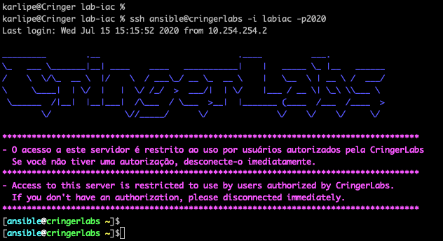

---
authors:
  - karlipe
date:
    created: 2020-05-26
---

# **Hello World Again, one more time, now in that platform !**

<figure markdown="span">
  
</figure>

Bem vindo ao Blog/Wiki CringerLabs, este tem o objetivo de dividir o conhecimento de estudos/aprendizados com o mundo, nada fora do normal para quem é apaixonado por OpenSource. Mesmo que a ferramenta seja OpenSource ou não, pretendo compartilhar o que consegui e como consegui para que vocês consigam testar e assim nós possamos trocar experiencias. 

<!-- more -->

Pretendo manter o portal atualizado com dicas, how-tos, sugestões e arquitetura de ambientes. Dentre eles pretendo falar de Infraestrutura, Conectividade, Virtualização(todas as que utilizo), Cloud(conceitos e ferramentas), dicas de ambientes e testes em laboratório.

Karlipe Gomes