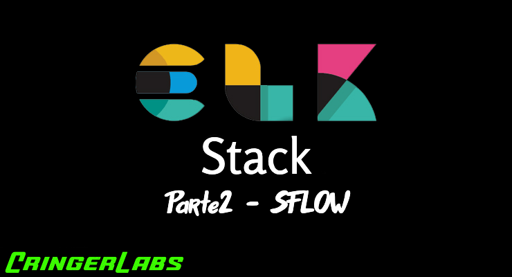

---
authors:
  - karlipe
date:
    created: 2020-06-02
categories:
    - ToolTip
tags:
    - elk
---

# **#ToolTip - ELK Stack - Part2(SFLOW)**

<figure markdown="span">
  
</figure>

Na parte 1 foi discutindo um pouco sobre a ferramenta e sua utilização, neste post irei demonstrar algumas utilizações reais de utilização:

Um uso bastante comum é o de logs de rede, quando um equipamento de rede (switch/router/firewall/..) está com sflow habilitado ele envia alguns dados estatisticos regularmente para o servidor sflow configurado. Esse período geralmente se baseia em quantidade de pacotes trafegados, podendo ser 1/1000(um de mil), 1/10000(um de dez mil), 1/100000(um de cem mil), 1/1000000(um de um milhão) a depender da marca/modelo do switch e principamente do poder de processamento disponivel no mesmo, pois quanto mais frequente o envio, mais exige do equipamento. 

<!-- more -->

Configuração do Logstash
```bash
[root@elk ~]# cd /usr/share/logstash/bin/
[root@elk bin]# ./logstash-plugin install logstash-codec-sflow
[root@elk ~]#
[root@elk ~]# vim /etc/logstash/conf.d/10-sflow.conf
input {
        udp {
                port => 6343
                codec => sflow {}
                type => "sflow"
        }
}
output {
        if [type] == "sflow" {
                elasticsearch {
                        hosts => ["<IP DO ELASTIC>:9200"]
                        index => "sflow-%{+YYYY.MM.dd}"
                }
        }
}
  
[root@elk ~]# systemctl restart logstash
[root@elk ~]# firewall-cmd --permanent --add-port=6343/udp
success
[root@elk ~]# firewall-cmd --reload
success
[root@elk ~]#
```

Configuração no Switch
```bash
interface GigabitEthernet1/0/10
 sflow sampling-rate 1000
 sflow flow collector 1
#
interface GigabitEthernet1/0/11
 sflow sampling-rate 1000
 sflow flow collector 1
#
interface GigabitEthernet1/0/12
 sflow sampling-rate 1000
 sflow flow collector 1
#
interface GigabitEthernet1/0/13
 sflow sampling-rate 1000
 sflow flow collector 1
#
interface GigabitEthernet1/0/22
 sflow sampling-rate 1000
 sflow flow collector 1
#
interface GigabitEthernet2/0/10
 sflow sampling-rate 1000
 sflow flow collector 1
#
interface GigabitEthernet2/0/11
 sflow sampling-rate 1000
 sflow flow collector 1
#
interface GigabitEthernet2/0/12
 sflow sampling-rate 1000
 sflow flow collector 1
#
interface GigabitEthernet2/0/13
 sflow sampling-rate 1000
 sflow flow collector 1
#
interface GigabitEthernet2/0/22
 sflow sampling-rate 1000
 sflow flow collector 1
#
 sflow agent ip <IP DO SWITCH>
 sflow source ip <IP DO SWITCH>
 sflow collector 1 ip <IP DO LOGSTASH> description "CLI Collector"
#
```

Após esses procedimentos, o switch irá começar a enviar pacotes para o ELK, fazendo com que o index seja criado e alimentado. Mas para que ele seja visivel é necessário criar o  (Index Patterns).


Conforme colocamos no arquivo de configuração, o prefixo definido é “sflow-“, logo, esse será o pattern a ser criado.


Abaixo demonstra como é a visualização no ELK.


Quanto a parte de configuração é isso. A partir de agora você pode determinar/criar visualizações a partir das opções disponiveis.

Exemplos de Filtros possíveis.
