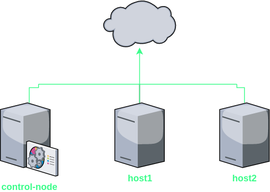
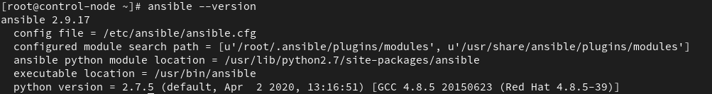
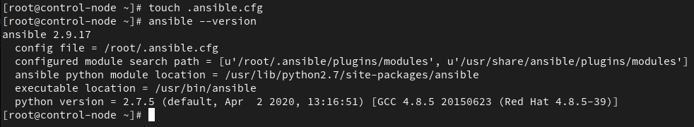
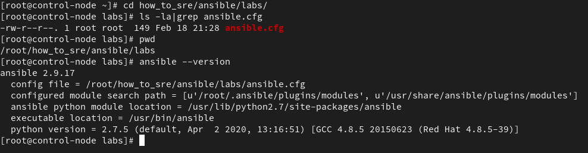
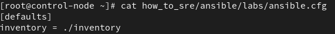
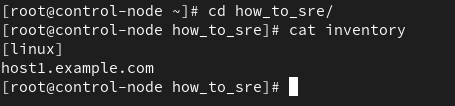
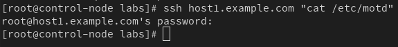
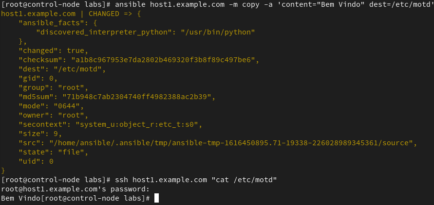
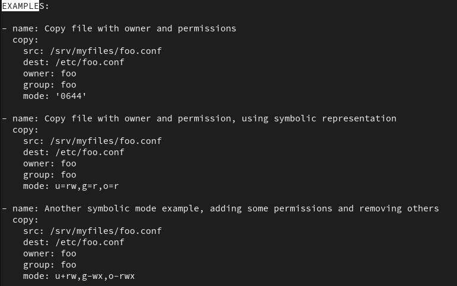

---
authors:
  - karlipe
date:
    created: 2021-03-22
categories:
    - SRE/DevOps
tags:
    - ansible
---

# **#HowToSRE - Ansible-Parte01**

<figure markdown="span">
  
</figure>

### Pre-requisitos e Orientações

Antes de iniciar é importante entender como o ambiente de lab está sendo pensado. Utilizaremos a principio 3 VMs, sendo uma delas a **control-node** e outras duas os servidores onde testaremos de fato as funcionalidades do ansible.

Segue abaixo um desenho de como se espera que esteja montado.

<!-- more -->



Quanto ao endereçamento IP, você pode se sentir livre para definir qual utilizar, desde que todas as VMs tenham **acesso a internet** para realizar o download e instalação de pacotes. Todas as VMs utilizadas nesse lab serão ***CentOS***. Caso seja necessário adicione no "/etc/hosts" os endereços dos hosts.
<br/><br/>

## Understanding Ansible

Ansible é uma ferramenta desenhada para SysAdmins que precisam automatizar provisionamento, configuração, deploy de aplicações e orquestração. O projeto foi pensado para que fosse simples, otimizado e de fácil entendimento. Hoje é um projeto da comunidade OpenSource que é patrocinado pela [**Red Hat**](https://www.ansible.com/), mas apesar disso é totalmente compatível com outras distribuições como Ubuntu/Debian e [**outros**](https://docs.ansible.com/ansible/latest/installation_guide/intro_installation.html).
<br/><br/>

### Why?
- **Agentless**
    
    Não é necessário a instalação de agentes de comunicação com o host que está executando o playbook. Sendo assim o controle de forma descentralizada, podendo ser executado a partir de qualquer máquina que tenha a comunicação garantida com o servidor de destino. Ansible se conecta nos hosts gerenciados a partir de SSH ou WinRM no caso de Windows.

- **Simple** (yaml)

    A implementação é de fácil compreensão para humanos, isso significa que a leitura dos playbooks não iria gerar uma complicação, pois a linguagem é descritiva. Geralmente é utilizado no formato ***yaml***, mas podendo ser utilizado também no formato ***json***.

- **Powerful**

    A aplicabilidade do **Ansible** pode ser muito diferenciada, podendo ser utilizada em um workflow de automação, automação de rede, orquestrar o ciclo de vida de aplicações, gerenciar configuração e instalação de pacotes em servidores.

<br/><br/>

## Ansible Configuration

### Installation

O primeiro passo que precisamos dar é a instalação do ansible no servidor de control-node.

```bash
yum install epel-release -y
yum install ansible
ansible --version
```



Dois dos arquivos mais importantes de toda configuração do ansible são "**ansible.cfg**" e "**inventory**", onde ficam salvos e armazenados todas as configurações e a lista de inventário de hosts, respectivamente.
<br/><br/>

### ansible.cfg

Como pode ser visto no print anterior o diretório padrão é "**/etc/ansible/ansible.cfg**". Mas quando se administra vários tipos de ambientes, e/ou quando o ***control-node*** é acessado por mais de um administrador as vezes é necessário realizar alterações neste arquivo para que se encaixe na configuração para cada usuário. Neste caso é indicado que cada usuário tenha um arquivo de configuração em sua home, ex: "**~/.ansible.cfg**". Observe no print abaixo que a localização do arquivo de configuração foi alterado.



Mas caso mesmo assim seja interessante que em cada projeto tenha configurações diferenciadas para atender demandas específicas, é possivel ainda que cada projeto tenha o seu proprio arquivo de configuração, bastando adicionar o arquivo na raiz do seu projeto, onde pretende executar os playbooks, conforme abaixo:

<br/><br/>

### inventory

O arquivo de inventário defaul do ansible tem o caminho "**/etc/ansible/hosts**", mas já que iremos realizar vários projetos contendo arquivos "**ansible.cfg**" diferentes, vamos definir um arquivo de configuração que será utilizado por todos através da variável "*inventory*", conforme exemplo abaixo:



Definiremos então um grupo chamado **linux**, contendo o FQDN do primeiro host que iremos testar.



Os inventários podem ser de dois tipos estático, definido fixamente através do arquivo acima, e dinâmico que fazendo a utilização de módulos, pode se conectar em clouds, service providers e virtualizadores e colher as informações necessárias.

Quanto a forma de implementação podem ser feitas de 2 formas **INI** and **YAMl**. Segue exemplo comparativo da mesma configuração. Mas para padronização, utilizaremos o formato **INI**.

**INI**
```
lb.example.com

[web]
server1.example.com
server2.example.com

[database]
server3.example.com
```
**YAML**
```yaml
all:
    hosts:
        lb.example.com:
    children:
        web:
            hosts:
                server1.example.com:
                server2.example.com:
        database:
            hosts:
                server3.example.com:
```
<br/><br/>

## Ansible Documentation

### ad-hoc Commands

Para iniciar configurações básicas com ansible, podemos utilizar a forma "ad-hoc", que se baseia em escrever as ações diretamente na linha de comando. O primeiro passo necessário é a troca de chave entre os servidores.
```
# ssh-keygen
# ssh-copy-id host1.example.com
root@host1.example.com's password: 

Number of key(s) added: 1

Now try logging into the machine, with:   "ssh 'host1.example.com'"
and check to make sure that only the key(s) you wanted were added.
```

Como já definimos um host no inventário anterior, vamos para o diretório onde está o arquivo ansible.cfg e vamos testar a conectividade através do módulo ping. O exemplo abaixo, representa uma tentativa com conectividade ok!

```
[root@control-node labs]# ansible all -m ping
host1.example.com | SUCCESS => {
    "ansible_facts": {
        "discovered_interpreter_python": "/usr/bin/python"
    }, 
    "changed": false, 
    "ping": "pong"
}
```

Podemos testar o conteudo do arquivo /etc/motd, do servidor host1. Como não está exibindo nada, o arquivo está vazio.



Ao utilizarmos o módulo *copy*, e os argumentos *content* para definir o conteúdo e *dest*, para definir o arquivo de destino. O binário do Ansible, já nos mostra que o arquivo foi alterado e assim ainda informa algumas informações sobre o mesmo.



E como pode ser notado, agora o arquivo tem o conteúdo indicado.
<br/><br/>

### ansible-doc

Ok chegamos num ponto onde já temos o executável instalado, trocamos a chave e testamos o funcionamento do ansible. Mas para que possamos implementar playbooks com ações e configurações necessárias, é importante que saibamos qual módulo utilizar, assim como quais argumentos devem ser passados.

Para isso temos o binário de documentação, **ansible-doc**, onde podemos listar e consultar os módulos e argumentos existentes:

Listar os módulos existentes/instalados.
```bash
ansible-doc -l
```

Listar os módulos existentes/instalados, filtrando por ações que se espera encontrar.
```bash
ansible-doc -l | grep -i copy
```

Listar os os argumentos presentes no módulo com breve explicação.
```bash
ansible-doc -s copy
```

Listar documentação completa sobre o módulo
```bash
ansible-doc copy
```

**DICA:**
Ao entrar na documentação completa do módulo você pode pesquisar por "EXAMPLES", onde será exibido vários exemplos de configuração e como utilizar de forma correta o módulo.


<br/><br/>

## Ansible Playbook

Quando é necessário realizar várias ações consecutivas, ou que pelo menos fique gravado/versionado as ações realizadas, não se torna interessante a utilização de módulos direto através da CLI. Para isso utilizaremos um arquivo chamado de playbook, onde indicará quais hosts executaremos as atividades e quais as tarefas a serem realizadas.

Segue exemplo, baseado na atividade anterior.
```yaml
# vim motd.yml
---
- name: Alterarando arquivos
  hosts: host1.example.com
  tasks:
    - name: Alterando conteudo do /etc/motd
      copy:
        content: "Bem Vindo"
        dest: /etc/motd
```

Uma forma simples de verificar se o playbook está escrito de forma correta é utilizar a opção "--syntax-check", conforme exemplo abaixo. É importante dizer que esta opção apenas verifica sintaxe do arquivo, considerando identação e existencia do módulo. 

```bash
ansible-playbook --syntax-check motd.yml
```

Para executar basta:
```bash
ansible-playbook motd.yml
```

Uma outra forma de simular a execução do playbook é utilizando a opção "-C", onde será verificado através de um ***dry-run**, checando as execuções mas não executando nenhuma de fato.

```bash
ansible-playbook -C motd.yml
```
<br/><br/>

## Dica do Sucesso

Edite o arquivo "/etc/vimrc" e adicione ao final do mesmo para ficar com tabulação, espaçamento, a coluna, numeração e a coluna para ajudar você nos seus arquivos yaml.

```vim
autocmd FileType yaml setlocal ai ts=2 sw=2 et nu cuc
autocmd FileType yaml colo desert
```
<br/><br/>

## Exercicio

Todo dia de repasse será entregue um LAB baseado no conteudo repassado. Tente realizar o exercicio, caso tenha alguma dificuldade pode checar o arquivo no projeto do GitHUB, ou no link do vídeo.

### LAB01

- Montar um servidor WEB
    - Instalar o pacote httpd
    - Habilitar o serviço httpd em execução e no boot
    - Liberar porta de serviço httpd
    - Copiar o:
        - conteudo: "CringerLabs Ansible !!"
        - para o destino: "/var/www/html/index.html"

### Links do repasse

Divido entre labs e solutions, **labs** você irá encontrar os exercicios e os arquivos necessários, quando existirem. E no diretório **solutions** o exericio resolvido, conforme vídeo. Segue como estão divido os diretórios.

[**GITHUB - #HowToSRE Ansible**](https://github.com/karlipegomes/how_to_sre-ansible)

```bash
# cd how_to_sre-ansible
$ tree .     
.
├── README.md
├── labs
│   ├── lab01
│   │   └── EXERCICIO_lab01.md
│   ├── lab02
│   │   └── store.sql
│   └── lab03
│       └── block.txt
└── solutions
    ├── ansible.cfg
    ├── inventory
    ├── lab01
    │   ├── add-user.yml
    │   ├── lab01.yml
    │   └── meuprimeiro-playbook.yml
    └── lab02
        └── store.sql
```

[**SLIDES**](https://drive.google.com/file/d/1bTMCey7KlgschjFbiC5q-_QKwN-Ty31q/view?usp=sharing)

<p align="center">
<iframe width="1000" height="562" src="https://www.youtube.com/embed/DxjmKeFe6EY" title="YouTube video player" frameborder="0" allow="accelerometer; autoplay; clipboard-write; encrypted-media; gyroscope; picture-in-picture" allowfullscreen></iframe>
</p>


### Agradecimentos.

Obrigado ao Joel e ao Joaquim por revisarem o material.

[Joel-Linkedin](https://www.linkedin.com/in/joelcostapinheiro/) - [Joel-Blog](https://joelpinheiro.com/) 

[Joaquim-Linkedin](https://www.linkedin.com/in/joaquimnetto/)