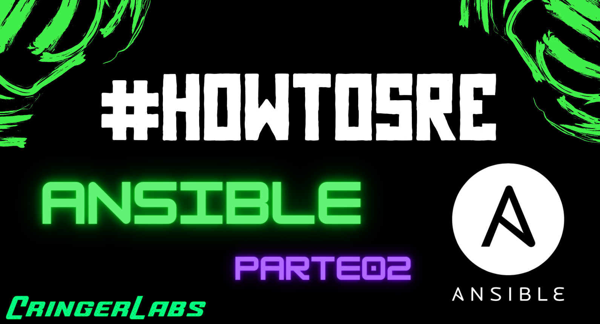
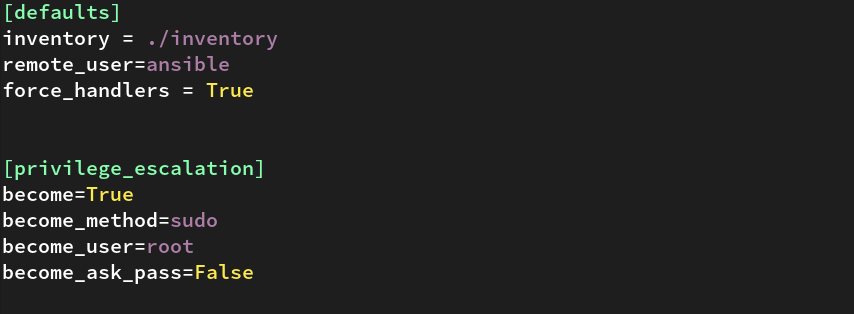

---
authors:
  - karlipe
date:
    created: 2021-03-30
categories:
    - SRE/DevOps
tags:
    - ansible
---


# **#HowToSRE - Ansible-Parte02**

<figure markdown="span">
  
</figure>

## Playbooks Advanced
Como vimos no [**post anterior**](https://cringerlabs.com/sre/training/ansible/2021/03/21/How-to-SRE_Ansible01/#/), criar um playbook não é algo muito complicado. Tentaremos então deixar um pouco mais divertido. Veja como é interessante e as grandes possibilidades que o Ansible é capaz de entregar!

<!-- more -->

### Ignoring Errors

Um opção bastante interessante é a de ignorar erros durante a execução de playbook, não é recomendado, nem indicado que coloque esta opção em ambientes de produção e/ou com criticidade alta. Mas normalmente a mesma é utilizada para execução quando se tem certeza que alguns hosts estão indisponíveis ou irão apresentar erros conhecidos. Pois como você já deve ter percebido a execução completa do Playbook é cancelada ao apresentar qualquer erro!

A configuração correta ficaria então:

```yaml
$ vim motd.yml
---
- name: Alterarando arquivos
  hosts: host1.example.com
  gather_facts: no
  ignore_erros: yes
  ...
```

Tambem é possivel inserir esta opção dentro de uma task específica caso não queria que fique disponíel para o playbook inteiro, ex:

```yaml
$ vim install_httpd.yml
...
  tasks:
    - name: Install httpd package
      yum:
        name: httpd
        state: present
      ignore_erros: yes
...
```
<br/><br/>

## Vars (Variáveis)

Provavelmente a opção mais utilizada no ansible seja a de consumir variáveis definidas no playbook. Mas existem algumas formas de se fazer isso.

### Arquivo de Inventário

Definindo para grupos ou variáveis, conforme exemplo abaixo:
```shell
$ cat inventory
host2.example.com

[linux]
host1.example.com

[linux:vars]
user=karlipe
```
<br/><br/>

### Arquivos externos
Podendo este ser divididos entre 2 formas comuns. A primeira é definindo variaveis direcionadas a cada host em especifico. Dentro da pasta do seu projeto, deve criar um diretório "*host_vars*" e em seguida criar um arquivo com o nome do host definido no inventário contendo as informações necessárias, como no exemplo abaixo:

```shell
$ cat host_vars/host1.example.com
package: http
$ cat host_vars/host2.example.com
package: mariadb
```

A segunda forma seria ao invés de definir variáveis utilizando arquivos individuais, é utilizando o nome de grupos definidos no inventário. Dentro da pasta do seu projeto, deve criar um diretório "*group_vars*" e em seguida criar um arquivo com o nome do grupo que queira referenciar, sendo o mesmo definido no inventário contendo as informações necessárias, como no exemplo abaixo:
```shell
$ cat group_vars/linux
package: vim
```
<br/><br/>

### Dentro do Playbook
Já quando se usa Playbooks pequenos e com poucas tasks, o jeito mais fácil de gerenciar é inserindo as informações de variaveis dentro do proprio playbook. As boas práticas indicam que o melhor formato é declara-las no inicio do arquivo:


```yaml
---
- name: Install commom packages
  hosts: host1.example.com
  vars:
    package:
      - vim
      - wget
      - git
  tasks:

    - name: Install {{ package }} packages
      yum:
        name: "{{ package }}"
        state: present
  ...
```


Mas também é possivel que você encontre Playbooks pela internet, onde são declaradas apenas quando forem ser utilizadas, através de loops:


```yaml
$ vim install_basic_packages.yml
...
  tasks:
    - name: Install basic packages
      yum:
        name: "{{ item }}"
        state: present
      loop:
        - net-tools
        - tcpdump
        - bind-utils
...
```

<br/><br/>

## Handlers

**Handlers** são tasks que respondem a gatilhos acionados por outras tasks. A Task manda uma notificação quando ela é “alterada” que por sua vez executa a ação definda. Boas práticas indicam que ao definir handlers no Playbook, o mesmo fique ***identado*** igualmente a coluna da opção **tasks**, conforme exemplo abaixo:

```yaml
$ vim install_ftp.yml
...
  tasks:
    - name: Install vsftpd
      yum:
        name: vsftpd
        state: present
      notify: Restart vsftpd
  
  handlers:
    - name: Restart vsftpd
      service:
        name: vsftpd
        state: restarted
...
```

É importante salientar que os handlers tem que ter exatamente o mesmo nome escrito no gatilho(**notify**), para que ele seja reconhecido e por consequência, executado.
<br/><br/>

### Controlling Handlers in Failure

Caso exista alguma necessidade especial, é possivel forçar a execução de handlers, mesmo quando a task falhe na execução de algum host. Para forçar é necessário apenas executar junto na linha do Playbook:

```bash
$ ansible-playbook playbook-handler.yml --force-handlers
```

Tambem é possivel definir dentro do Playbook:
```yaml
$ vim motd.yml
---
- name: Alterarando arquivos
  hosts: host1.example.com
  force_handlers: True
  ...
```

Caso você queira generalizar para todos os playbooks dos seus projetos é possivel adicionalo ao arquivo de configuração "**ansible.cfg**".


<br/><br/>


### Flushing Handlers

Como vocês sabem todos os handlers são executados somente na finalização do playbook. Caso você tenha muitas tasks e alguma dessas tasks tenha dependência e você precise que seja executada de forma imediata, existe uma opção que irá te salvar, um módulo chamado meta.
```yaml
$ vim motd.yml
---
- name: Forcing handlers execution
  meta: flush_handlers
  ...
```
<br/><br/>

## Exercicio

Todo post de repasse será entregue um ou mais LABs baseados no conteudo repassado. Tente realizar o exercicio, caso tenha alguma dificuldade pode checar o arquivo no projeto do GitHUB, ou no link do vídeo.

### LAB02
- Utilizando as melhores práticas monte um Banco de Dados no **host2**.
    - Instalar a seguir pacotes (utilizando variáveis)
        - mariadb-server
        - MySQL-python
    - Habilitar serviço para iniciar imediatamente e permanecer ao boot
    - Liberar porta do serviço mysql
    - Criar database “store”
    - Copiar conteudo para base de dados (store.sql)
    - Checar se dados estão corretos

### LAB03 
- Criar um template de instalação base para todos os hosts.
    - Definir hostname igual a inventário
    - Instalar Repositorio EPEL (pacote epel-release)
    - Instalar pacotes bases:
        - (tcpdump, net-tools, bind-utils, vim, git, open-vm-tools, htop, screen)
    - Atualizar servidores
    - Copiar arquivo motd personalizado para /etc/motd
    - Personalizar bash 
        - Adicionar o conteudo do arquivo block.txt, ao final do arquivo /etc/bashrc


## Links do repasse

Divido entre labs e solutions, **labs** você irá encontrar os exercicios e os arquivos necessários, quando existirem. E no diretório **solutions** o exericio resolvido, conforme vídeo. Segue como estão divido os diretórios.

[**GITHUB - #HowToSRE Ansible**](https://github.com/karlipegomes/how_to_sre-ansible)

```bash
$ cd how_to_sre-ansible
$ tree .
.
├── README.md
├── labs
│   ├── lab01
│   │   └── EXERCICIO_lab01.md
│   ├── lab02
│   │   └── store.sql
│   └── lab03
│       └── block.txt
└── solutions
    ├── ansible.cfg
    ├── inventory
    ├── lab01
    │   ├── add-user.yml
    │   ├── lab01.yml
    │   └── meuprimeiro-playbook.yml
    └── lab02
        └── store.sql
```

[**SLIDES**](https://drive.google.com/file/d/1aVdvoB2ks4XVyrQy7Wwvj_5e0awPkhjk/view?usp=sharing)

<p align="center">
<iframe width="1000" height="562" src="https://www.youtube.com/embed/KencJeZ20qM" title="YouTube video player" frameborder="0" allow="accelerometer; autoplay; clipboard-write; encrypted-media; gyroscope; picture-in-picture" allowfullscreen></iframe>
</p>


### Agradecimentos.

Obrigado ao Joel por revisar o material e ao Joaquim por ser minha cobaia nesse repasse. <3

[Joel-Linkedin](https://www.linkedin.com/in/joelcostapinheiro/) - [Joel-Blog](https://joelpinheiro.com/) 

[Joaquim-Linkedin](https://www.linkedin.com/in/joaquimnetto/)