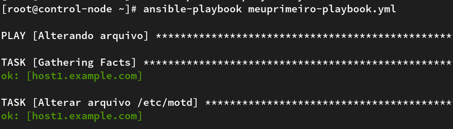
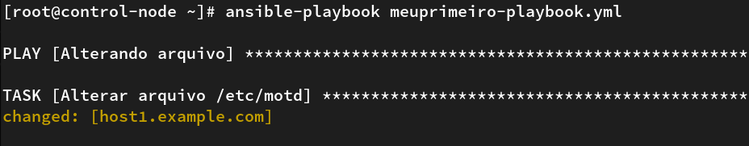
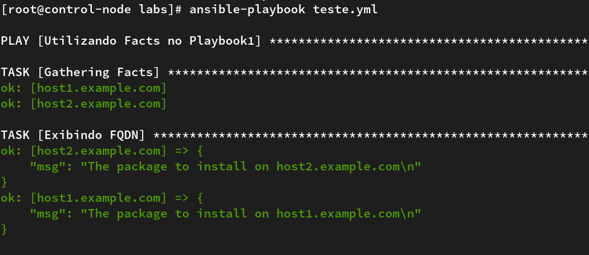
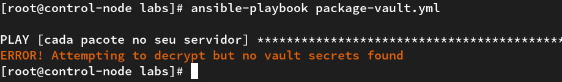

---
authors:
  - karlipe
date:
  created: 2021-04-06
  updated: 2021-04-06
categories:
  - SRE/DevOps
tags:
  - ansible
---


# **#HowToSRE - Ansible-Parte03**

<figure markdown="span">
  
</figure>


E ae galera beleza? Nesse post iremos falar um pouco sobre o que são Facts e como podemos utilizar as informações contidas neles. Falaremos também sobre Ansible Vault, qual sua utilidade, exemplos e como utilizar na prática, além de claro ter como praticar com alguns LABs.

Aproveitem!! 🤙🤙

<!-- more -->

## Facts
### Como obter informações
**Facts** ou Fatos são informações do servidor destino que podem ser obtidas utilizando ansible que retornam utilizando variáveis nativas do ansible. Exemplo:

```shell
$ ansible host1.example.com -m setup 
host1.example.com | SUCCESS => {
    "ansible_facts": {
        "ansible_all_ipv4_addresses": [
            "172.31.2.51"
        ], 
        "ansible_all_ipv6_addresses": [
            "fe80::5cd8:2eaf:3adf:c23a"
        ], 
        "ansible_apparmor": {
            "status": "disabled"
        }, 
        "ansible_architecture": "x86_64", 
        "ansible_bios_date": "12/12/2018", 
        "ansible_bios_version": "6.00", 
        ....
        ....
```

Existe a possibilidade de ainda utilizando o modo ad-hoc mas filtrar algumas informações caso julgue importante. Exemplo:
```shell
$ ansible host2.example.com -m setup -a "filter=ansible_kernel"
host2.example.com | SUCCESS => {
    "ansible_facts": {
        "ansible_kernel": "3.10.0-1160.21.1.el7.x86_64", 
        "discovered_interpreter_python": "/usr/bin/python"
    }, 
    "changed": false
}
```
<br/><br/>
### Desabilitando Gathering Facts
Caso você não tenha notado nos vídeos dos repasses anteriores, sempre ao início de cada execução dos playbooks, este função é realizada a fim de colher informações que talvez sejam necessárias para a execução correta do Playbook.



Uma **boa prática** importante, caso você não a necessidade de usar essas informações e/ou caso você tenha um grande grupo de máquinas para executar, o que pode causar uma certa lentidão no ambiente, o indicado é desabilitar esta opção dentro do playbook, da seguinte forma:

```yaml
$ vim motd.yml
---
- name: Alterarando arquivos
  hosts: host1.example.com
  gather_facts: no
  ...
```



<br/><br/>

### Custom Facts
Administradores podem criar Facts Personalizados para seus hosts gerenciados, estas informações ficarão gravads localmente em cada host. Por padrão os Facts personalizados são salvos em arquivos "**.fact**" e salvos no diretório "**/etc/ansible/facts.d/**". Estes arquivsão são escritos no formato INI ou também podem ser escritos no formato json. Segue abaixo um exemplo de um arquivo escrito no formato INI. Onde assim como no inventário o grupo é definido pelo nome entre colchetes "**[...]**" e logo abaixo a variável com a definição de valor.

```shell
$ cat /etc/ansible/fact.d/cringerlabs.fact
[environment]
deploy = prod

[general]
package = nginx
```

E assim como os Fatos nativos, estes também podem ser consumidos pelo binário de forma ad-hoc, filtrando pelo parâmetro "**ansible_local**".
```shell
$ ansible host2.example.com -m setup -a "filter=ansible_local"
host2.example.com | SUCCESS => {
    "ansible_facts": {
        "ansible_local": {
            "cringerlabs": {
                "environment": {
                    "deploy": "prod"
                }
                "general": {
                    "package": "nginx"
                }
            }
        }
        "discovered_interpreter_python": "/usr/bin/python"
    }, 
    "changed": false
}
```
<br/><br/>

### Utilizando Facts no Playbook 
Um exemplo básico de utilização de Facts no playbook é conforme o exemplo abaixo. Utilizando a variável "**ansible_fqdn** podemos obter o fqdn de todos os hosts envolvidos.

```yaml
---
- name: Utilizando Facts no Playbook01
  hosts: all
  tasks:
  - name: Exibindo FQDN
    debug:
      msg: >
        The package to install on {{ ansible_fqdn }}
```




Outra forma igualmente elegante é utilizar custom facts, com base no exemplo citado mais acima veja como é simples de instalar um pacote.

```yaml
---
- name: Utilizando Facts no Playbook02
  hosts: all
  tasks: 
  - name: Instalando Pacotes
    yum:
      name: "{{ ansible_facts.ansible_local.cringerlabs.general.package }}"
      state: latest
```


Como visto no exemplo, é necessário informar toda a cadeia de grupos até a variávei que será utilizada na task.

<br/><br/>

## Ansible Vault
**Ansible Vault** veio para dar um alívio aos Administradores que necessitam passar informações sensíveis como senhas, api keys, chaves de acesso dentre outros, em seus playbooks e não podem utilizar essa informações em texto plano. Ao instalar o pacote do ansible já é possível utiliza-lo para encriptar e decriptar qualquer arquivo que poderá ser utilizado pelo ansible, incluindo: inventário, arquivos de variáveis, playbooks.


### Manipução de arquivos encriptados
Segue abaixo uma exemplificação de como fazer:

**Criação de arquivo**
```shell
$ ansible-vault create arquivo.yml
New Vault password: 
Confirm New Vault password:
```

**Edição de arquivo encriptado**
```shell
$ ansible-vault edit arquivo.yml
Vault password: 
```

**Visualização de arquivo encriptado**
```shell
$ ansible-vault view arquivo.yml
Vault password: 
```

**Encriptar arquivo ja existente**
```shell
$ ansible-vault encrypt arquivo.yml 
New Vault password: 
Confirm New Vault password:
```

**Decriptar arquivo ja existente**
```shell
$ ansible-vault decrypt arquivo.yml --output=arquivo-decriptado.yml
Vault password: 

$ ls
arquivo.yml
arquivo-decriptado.yml
```

**Recriação de chave vault em arquivo encriptado**
```shell
$ ansible-vault create arquivo.yml
Vault password: #senha_atual
New Vault password: #senha_nova
Confirm New Vault password: #senha_nova
```

Caso você não queria ter que digitar a senha é possivel utilizar um arquivo contendo a senha para automatização de scripts.

**Conteudo do arquivo**
```shell
$ cat senha-vault.txt
password
```

**Visualização de conteúdo utilizando arquivo de senha**
```shell
$ ansible-vault view --vault-password-file=senha-vault.txt arquivo.yml

```

**Edição de conteúdo utilizando arquivo de senha**
```shell
$ ansible-vault edit --vault-password-file=senha-vault.txt arquivo.yml

```
<br/><br/>

### Utilizando Ansible Vault no Playbook

Supondo que o arquivo de variaveis do grupo esteja criptografado "**/group_vars/linux**", e você queira instalar um pacote "httpd" definido no mesmo. Ao tentar executar o Playbook você irá se depará com a seguinte tela.



No erro informa que não foi encontrado "vault secrets" para decriptar o Playbook. Em outras palavras é necessário que você passe o secret para o Playbook e há duas formas simples de fazer isso.

A primeira que é solicitar que o Playbook pergunte a senha de forma, conforme abaixo:
```shell
$ ansible-playbook --vault-id @prompt package-vault.yml
Vault password:

PLAY [cada pacote no seu servidor] **********************************************************************

TASK [Gathering Facts] **********************************************************************************
ok: [host1.example.com]

TASK [instando o pacote httpd] **************************************************************************
changed: [host1.example.com]

PLAY RECAP **********************************************************************************************
host1.example.com          : ok=2    changed=1    unreachable=0    failed=0    skipped=0    rescued=0    ignored=0   

```

A segunda forma é utilizar arquivo de senha:
```shell
$ ansible-playbook --vault-password-file=senha-vault.txt package-vault.yml

PLAY [cada pacote no seu servidor] **********************************************************************

TASK [Gathering Facts] **********************************************************************************
ok: [host1.example.com]

TASK [instando o pacote httpd] **************************************************************************
changed: [host1.example.com]

PLAY RECAP **********************************************************************************************
host1.example.com          : ok=2    changed=1    unreachable=0    failed=0    skipped=0    rescued=0    ignored=0   

```
<br/><br/>

### Dica do sucesso!

Para acelerar processos de envolvendo criptografia, é aconselhado instalar o pacote **python-cryptography**. Por padrão o ansible utiliza funções do pacote "***python-crypto***", mas caso pretenda utilizar muitos arquivos encriptados o pacote **python-criptography** prover bibliotecas python que melhoram o desempenho.

```shell
$ yum install python-cryptography
```
<br/><br/>

## Exercicios

Todo post de repasse será entregue um ou mais LABs baseados no conteudo repassado. Tente realizar o exercicio, caso tenha alguma dificuldade pode checar o arquivo no projeto do GitHUB, ou no link do vídeo.

### LAB04
- Criar um playbook direcionado ao servidor host1
  - Adicionar um custom fact no servidor
    - Crie um arquivo chamado "cringerlabs.fact" e adione os fatos abaixo
      - Group: webserver
        - Variable: role 
          - Value: webserver
      - Group: general
        - Variable: port
          - Value: 80
        - Variable: package
          - Value: nginx
    - Leve este arquivo ao servidor no diretório correto.

- Criar um segundo playbook para consumir os facts criados no playbook anterior gerando a frase abaixo:
    A função do servidor host1 é '***role***', 
    o pacote que instala o serviço principal é o '***package***',
    que é executado na porta '***port***'/tcp."

### LAB05
- Criar Playbook direcionado ao host1.
  - Desinstalar o package httpd
    - Exiba o MacAddress com a seguinte frase
      - “O MacAddress do servidor host1 é 'fact_contendo_macaddress'.”
    - Instale o package criado no Fact
    - Libere o serviço criado no Fact
    - Inicie o serviço criado no Fact
      - Use handlers
      - Force a inicialização do handler imediatamente
    - Check a versão do nginx instalado
    - Exiba a versão no nginx
    - Crie um arquivo de variável para o host1 utilizando o Vault 
      - Variavel: “CringerLabs SECRETS!!!”
      - Utilize o valor dessa variável como conteúdo para o arquivo index.html com destino “/usr/share/nginx/html/”
      - Check se o arquivo foi substituido


## Links do repasse

Divido entre labs e solutions, **labs** você irá encontrar os exercicios e os arquivos necessários, quando existirem. E no diretório **solutions** o exericio resolvido, conforme vídeo. Segue como estão divido os diretórios.

[**GITHUB - #HowToSRE Ansible**](https://github.com/karlipegomes/how_to_sre-ansible)

```bash
$ cd how_to_sre-ansible
$ tree .
.
├── README.md
├── labs
│   ├── lab01
│   │   └── README.md
│   ├── lab02
│   │   └── store.sql
│   └── lab03
│       └── block.txt
└── solutions
    ├── ansible.cfg
    ├── inventory
    ├── lab01
    │   ├── add-user.yml
    │   ├── lab01.yml
    │   └── meuprimeiro-playbook.yml
    └── lab02
        └── store.sql
```

[**SLIDES**](https://drive.google.com/file/d/1L_t0sd7tXtGk_KjjmSFl9MUfCAMFkf12/view?usp=sharing)

<p align="center">
<iframe width="560" height="315" src="https://www.youtube.com/embed/bSw9hCO0XqE" title="YouTube video player" frameborder="0" allow="accelerometer; autoplay; clipboard-write; encrypted-media; gyroscope; picture-in-picture" allowfullscreen></iframe>
</p>


### Agradecimentos.

Obrigado ao Joel por revisar o material e ao Joaquim por ser minha cobaia nesse repasse. <3

[Joel-Linkedin](https://www.linkedin.com/in/joelcostapinheiro/) - [Joel-Blog](https://joelpinheiro.com/) 

[Joaquim-Linkedin](https://www.linkedin.com/in/joaquimnetto/)