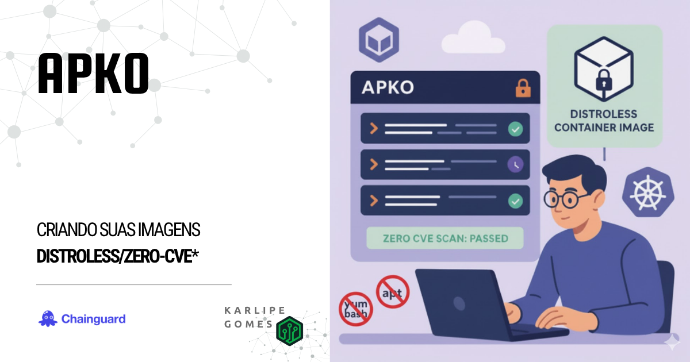

---
authors:
  - karlipe
date: 
    created: 2025-09-17
categories:
    - CloudNative
tags:
    - distroless
    - apko
    - chainguard
# readtime: 21
draft: true
---

# **APKO: Criando suas Imagens Distroless Distroless/Zero-CVE***

<figure markdown="span">
  
</figure>

Empresas que tratam segurança com seriedade sabem que gerenciar vulnerabilidades pode parecer um trabalho infinito. Dependendo do tamanho do seu workload, pode se tornar inviável corrigir todas as vulnerabilidades existentes. Isso pode fazer com que muitas nunca sejam tratadas — ou simplesmente sejam ignoradas.

E pior do que precisar atualizar softwares e ferramentas vulneráveis é manter pacotes que nem sequer são necessários para a execução da sua aplicação.

Agora, imagine se fosse possível — de forma simples — ter controle sobre todas as versões de softwares e ferramentas instalados, garantindo que suas imagens estejam, na prática, **Zero-CVE***.

<!-- more -->

## **Motivação**

O APKO é uma ferramenta para criar Imagens de Container(*single-layer*) baseadas em pacotes APK. Ele permite que você crie e mantenha suas próprias imagens base de serviços, de forma idempotente totalmente reproduzível em um único arquivo **YAML**.

Abaixo podemos ver uma exemplificação simples de como o processo funciona, envolvendo [**MELANGE**](2021-09-10-Melange.md) e o [**APKO**](2021-09-17-APKO.md). **Melange** gera pacotes APKs, usáveis em [**Alpine**](https://alpinelinux.org/about/)(Linux minimalista mantido pela comunidade) e [**Wolfi**](https://edu.chainguard.dev/open-source/wolfi/overview/)(Linux *undistro* mantida ChainGuard). E então o **APKO**, consegue usar tanto as imagens personalizadas, quanto as de ambos repositórios e gerar a partir daí imagens super minimalistas.

<figure markdown="span">
  
</figure>


Os principais ganhos são:

- Facilidade de reproduzir as imagens base.
- Possibilidade de especificar apenas dependências **NECESSÁRIAS** para o correto funcionamento da sua aplicação.
- Suporte a SBOMs (Software Bills of Materials), o que facilita a rastreablidade e controle de tudo que está instalado nas suas imagens.
- Diminuição dos vetores de ataque existentes no container, pois existirá apenas o mínimo necessário.

Um ponto importante sobre o **Zero-CVE*** é que mesmo que tenha apenas o pacote do seu serviço, caso ele tenha vulnerabilidades conhecidas, o APKO não resolverá isso, é necessário que o seu pacote escolhido TAMBEM não tenha vulnerabilidaes, mas caso isso seja possível de forma simples, garantimos pois nenhum outro pacote será instalado.

A Página de documentação da [**Chainguard**](https://edu.chainguard.dev/open-source/build-tools/apko/getting-started-with-apko/) é bem completa e pode ajudar bastante a entender, utilizando alguns exemplos práticos. Inclusive nem é necessário instalar nada, pois a partir do proprio container do apko *(via docker run)* é possível criar essas imagens.

## **Como Utilizar**

### **Pré-requisito**

- **Download da imagem**: Outro passo de boa prática mas não 100% necessário, porque indiretamente a imagem será baixada quando você executar de fato o comando, é baixar a ultima imagem disponível na sua máquina para que você consiga realizar alguns passos caso queira realizar de forma offline.

    ```shell title="Downloading APKO image"
    docker pull cgr.dev/chainguard/apko
    ```

- **Pacotes Customizados já criados**: Caso tenha interesse em aumentar o nível de personalização da sua image, poderá usar pacotes APKs customizados pelo seu time, para atender demandas de alguns DEVs especificamente.


## **Cenário Hipotético**

- **Mitigar vulnerabilidade das imagens das Aplicações**

    Imagine que sua empresa possui centenas de APIs expostas pra clientes, e que você tem que manter as imagens base atualizadas/livres de vulnerabilidade de forma a manter o **Compliance** exigido por seus clientes mais críticos. Tudo isso pensando em Multi-Arquitetura, neste caso: **X64 e ARM**.

    Versões utilizadas para exemplo:

      - [x] DotNet AspNET 8
        </br></br>

- **Situação Atual**

    Hoje todos os desenvolvedores utilizam as imagens padrões oferecidas pela Microsoft, tendo como base o Debian mais atual. *Dockerfile, processo e docker-compose são gerados automaticamente pela IDE com base no SDK escolhido.*

## **Exemplo Prático**

### **Criar Arquivo de Configuração**

Segue uma exemplificação de um arquivo .yaml que atende todas as necessidades citadas no cenário passado.

```yaml title="dotnet8-aspnet.yaml"
contents:
  keyring:
    - ./melange.rsa.pub
  repositories:
    - '@local /work/packages'
    - https://dl-cdn.alpinelinux.org/alpine/edge/main
  packages:
    - ca-certificates-bundle
    - dotnet8-aspnet@local
    
stop-signal: SIGTERM

work-dir: /app

accounts:
  groups:
    - groupname: company-user
      gid: 10000
  users:
    - groupname: company-user
      uid: 10000
  run-as: company-user

environment:
  DOTNET_ROOT: "/usr/share/dotnet"
  PATH: "/usr/local/sbin:/usr/local/bin:/usr/sbin:/usr/bin:/sbin:/bin:/usr/share/dotnet"
  ASPNETCORE_HTTP_PORTS: 80
  ASPNETCORE_URLS: "http://0.0.0.0:80"
  DOTNET_RUNNING_IN_CONTAINER: true

entrypoint:
  command: dotnet

archs:
  - amd64
  - arm64
```

#### Explicando as opções utilizadas:

- **Sections**
    - **contents**, Lista de onde o APKO irá buscar os conteudos, ordenado por:
        ```yaml hl_lines="1"
        contents:
          keyring:
            - ./melange.rsa.pub
            ..
        ```
        - **keyring**, Localização das chaves públicas para checagem das assinaturas dos pacotes.
            ```yaml hl_lines="2"
            contents:
              keyring:
                - ./melange.rsa.pub
                ..
            ```
        - **repositories**: Quais repositórios serão utilizados pra buscar os pacotes, podendo ser ambos locais ou remotos.
            ```yaml hl_lines="2"
            ..
              repositories:
                - '@local /work/packages'
                - https://dl-cdn.alpinelinux.org/alpine/edge/main
              ..
            ```
        - **packages**: Lista de pacotes necessários para a sua imagem, não necessário listar as subdependencias, isso será automaticamente buscado durante instalação.
            ```yaml hl_lines="2"
            ..
                packages:
                  - ca-certificates-bundle
                  - dotnet8-aspnet@local
              ..
            ```
    - **stop-signal**: Sinal de desligamento enviado pelo runtime ao processo principal no container. Neste caso o sinal enviado també é conhecido como 'graceful shutdown', pois o processo vai salvando estado, fechando conexões e liberando portas.
        ```yaml hl_lines="2"
        ..
        stop-signal: SIGTERM
        ..
        ```
    - **work-dir**: Diretório do serviço a ser executado.
        ```yaml hl_lines="2"
        ..
        work-dir: /app
        ..
        ```
    - **accounts**: É uma boa prática definir um user com pouquissima permissão/acesso para executar serviços, evitando o compromentimento do container. Essa config é usado para configurar contas de usuário na imagem e pode ser utilizado ao executar processos no container.
        ```yaml hl_lines="2 3 6 9"
        ..
        accounts:
          groups:
            - groupname: company-user
              gid: 10000
          users:
            - groupname: company-user
              uid: 10000
          run-as: company-user
        ..
        ```
    - **environment**: Lista de variáveis de ambiente da Imagem.
        ```yaml hl_lines="2"
        ..
        environment:
          DOTNET_ROOT: "/usr/share/dotnet"
          PATH: "/usr/local/sbin:/usr/local/b...
          ..
        ```
    - **entrypoint**: Define o comando ou serviço padrão que será executado em runtime.
        ```yaml hl_lines="2 3"
        ..
        entrypoint:
          command: dotnet
        ..
        ```
    - **archs**: Define a lista de arquiteturas que a imagem poderá ser *buildada*.
        ```yaml hl_lines="2"
        ..
        archs:
          - amd64
          - arm64
        ```

### **Execução e Arquivos Gerados**

Para ***buildar*** a Imagem, bastaria executar o comando abaixo. Nele podemos ver que está sendo referenciado quais arquiteturas serão utilizadas **`--arch amd64,arm64`**. Após a retag enviaremos a imagem para nosso registry.

```shell title="Building Image dotnet8-aspnet"
docker run --rm --workdir /work -v ${PWD}:/work \
  cgr.dev/chainguard/apko build dotnet8-aspnet.yaml \
  dotnet8-aspnet:test dotnet8-aspnet.tar --arch amd64,arm64

docker load < ./dotnet8-aspnet.tar

docker tag dotnet8-aspnet:test-amd64 harbor.mycompany.local/labs/dotnet8-aspnet:test-amd64
docker tag dotnet8-aspnet:test-arm64 harbor.mycompany.local/labs/dotnet8-aspnet:test-arm64

docker push --all-tags harbor.mycompany.local/labs/dotnet8-aspnet
```


Abaixo podemos ver uma exemplificação de Dockerfile 

```dockerfile title="Multi-Stage Dockerfile base"
FROM harbor.mycompany.local/labs/dotnet-builder-8:builder-arm64 as builder

WORKDIR /build

COPY ./ .

RUN dotnet publish -v q -c Release \
    --runtime linux-musl-arm64 \
    --self-contained false \
    --output publish

FROM harbor.mycompany.local/labs/dotnet8-aspnet:test-arm64

COPY --from=builder /build/publish /app

#ENTRYPOINT ["dotnet"] implicito pois já é mencionado no arquivo apko.
CMD ["API.dll"]
```

### **Comparação**

- **Velocidade de StartUp**

- **Tamanho**

Como pode ser visto no print abaixo, o tamanho da imagem utilizando APKO é praticamente metade da outra, mesmo a outra sendo uma imagem base do alpine, que é considerada clean.

<figure markdown="span">
  
</figure>

- **Vulnerabilidade**


## **Conclusão**

Caso você queria se manter atualizado ou com controle total das versões instaladas, o melhor caminho é você ter o proprio gerenciamento dos seus pacotes. Isso poderá ser mais complicado no princípio mas te dará mais liberdade de escolher/personalizar as suas imagens base.

Segue abaixo alguns links interessantes que podem ser úteis nessa jornada:

- [**examples**](https://github.com/chainguard-dev/apko/tree/main/examples)
- [**file description**](https://github.com/chainguard-dev/apko/blob/main/docs/apko_file.md)


Qualquer dúvida, me procura nas minhas redes, que a gente troca uma idéia!