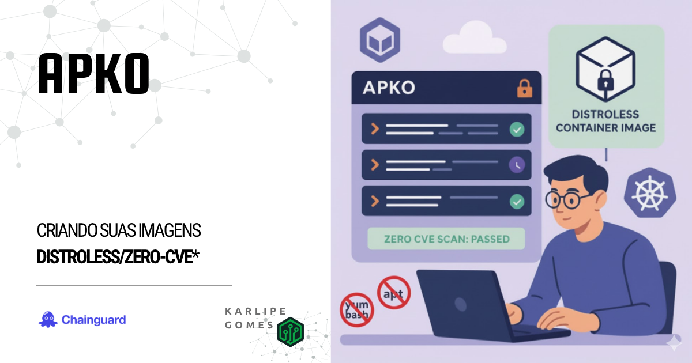
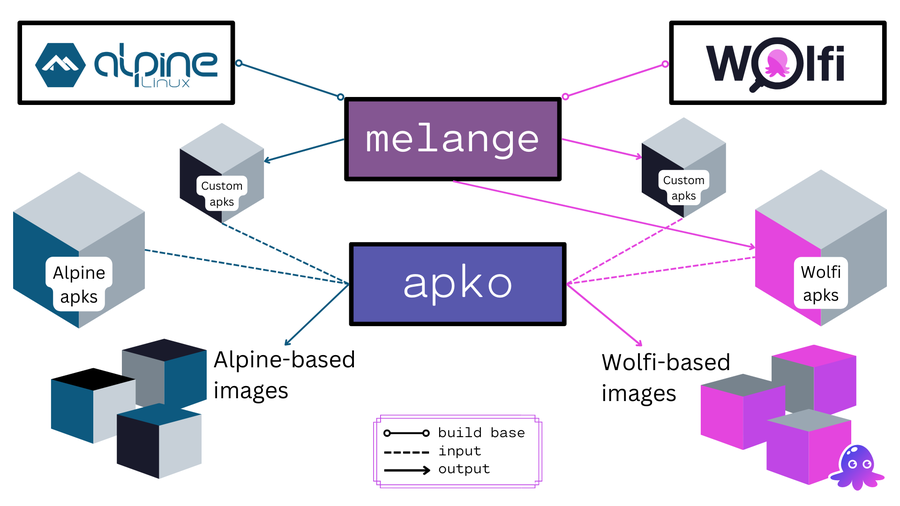
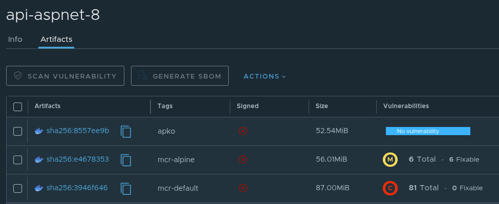
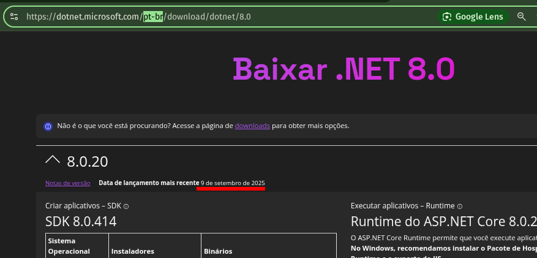
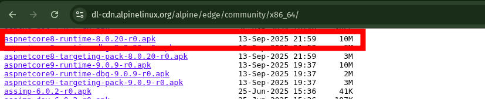
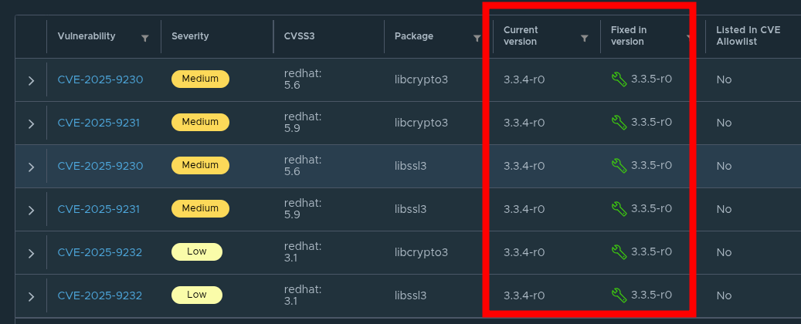

---
authors:
  - karlipe
date: 
    created: 2025-10-07
categories:
    - CloudNative
tags:
    - distroless
    - apko
    - chainguard
# readtime: 21
draft: true
---

# **APKO: Criando suas Imagens Distroless/Zero-CVE***

<figure markdown="span">
  
</figure>

Empresas que tratam segurança com seriedade sabem que gerenciar vulnerabilidades pode parecer um trabalho infinito. Dependendo do tamanho do seu workload, pode se tornar inviável corrigir todas as vulnerabilidades existentes. Isso pode fazer com que muitas nunca sejam tratadas — ou simplesmente sejam ignoradas.

E pior do que precisar atualizar softwares e ferramentas vulneráveis é manter pacotes que nem sequer são necessários para a execução da sua aplicação.

Agora, imagine se fosse possível — de forma simples — ter controle sobre todas as versões de softwares e ferramentas instalados, garantindo que suas imagens estejam, na prática, **Zero-CVE***.

<!-- more -->

## **Motivação**

O APKO é uma ferramenta para criar Imagens de Container(*single-layer*) baseadas em pacotes APK. Ele permite que você crie e mantenha suas próprias imagens base de serviços, de forma idempotente totalmente reproduzível em um único arquivo **YAML**.

Abaixo podemos ver uma exemplificação simples de como o processo funciona, envolvendo [**MELANGE**](2021-09-10-Melange.md) e o [**APKO**](2021-09-17-APKO.md). **Melange** gera pacotes APKs, usáveis em [**Alpine**](https://alpinelinux.org/about/)(Linux minimalista mantido pela comunidade) e [**Wolfi**](https://edu.chainguard.dev/open-source/wolfi/overview/)(Linux *undistro* mantida ChainGuard). E então o **APKO**, consegue usar tanto as imagens personalizadas, quanto as de ambos repositórios e gerar a partir daí imagens super minimalistas.

<figure markdown="span">
  
</figure>


Os principais ganhos são:

- Facilidade de reproduzir as imagens base.
- Possibilidade de especificar apenas dependências **NECESSÁRIAS** para o correto funcionamento da sua aplicação.
- Suporte a SBOMs (Software Bills of Materials), o que facilita a rastreablidade e controle de tudo que está instalado nas suas imagens.
- Diminuição dos vetores de ataque existentes no container, pois existirá apenas o mínimo necessário.

Um ponto importante sobre o **Zero-CVE*** é que mesmo que tenha apenas o pacote do seu serviço, caso ele tenha vulnerabilidades conhecidas, o APKO não resolverá isso, é necessário que o seu pacote escolhido TAMBEM não tenha vulnerabilidaes, mas caso isso seja possível de forma simples, garantimos pois nenhum outro pacote será instalado.

A Página de documentação da [**Chainguard**](https://edu.chainguard.dev/open-source/build-tools/apko/getting-started-with-apko/) é bem completa e pode ajudar bastante a entender, utilizando alguns exemplos práticos. Inclusive nem é necessário instalar nada, pois a partir do proprio container do apko *(via docker run)* é possível criar essas imagens.

## **Como Utilizar**

### **Pré-requisito**

- **Download da imagem**: Outro passo de boa prática mas não 100% necessário, porque indiretamente a imagem será baixada quando você executar de fato o comando, é baixar a ultima imagem disponível na sua máquina para que você consiga realizar alguns passos caso queira realizar de forma offline.

    ```shell title="Downloading APKO image"
    docker pull cgr.dev/chainguard/apko
    ```

- **Pacotes Customizados já criados**: Caso tenha interesse em aumentar o nível de personalização da sua image, poderá usar pacotes APKs customizados pelo seu time, para atender demandas de alguns DEVs especificamente.


## **Cenário Hipotético**

- **Situação Atual**

    Hoje todos os desenvolvedores utilizam as imagens padrões oferecidas pela Microsoft, tendo como base o Debian mais atual. *Dockerfile, processo e docker-compose são gerados automaticamente pela IDE com base no SDK escolhido.*

- **Objetivo: Mitigar vulnerabilidade das imagens das Aplicações**

    Imagine que sua empresa possui centenas de APIs expostas pra clientes, e que você tem que manter as imagens base atualizadas/livres de vulnerabilidade de forma a manter o **Compliance** exigido por seus clientes mais críticos. Tudo isso pensando em Multi-Arquitetura, neste caso: **X64 e ARM**.

    Versões utilizadas para exemplo:

      - [x] DotNet ASPNET 8
        </br></br>


## **Exemplo Prático**

### **Exemplo de pacote Melange, para dotnet 8**

Segue abaixo um pacote simplificado para criação do dotnet 8 aspnetcor utilizando o [**Melange**](2021-09-10-Melange.md), apenas com seus pré-requisitos declarados na documentação oficial.

??? abstract "melange.yaml"
    ```yaml
    package:
      name: dotnet-aspnet-8
      version: 8.0.20
      description: "ASPNET Core 8.0 Runtime"
      dependencies:
        runtime:
          - ca-certificates-bundle
          - libgcc 
          - libgdiplus
          - libssl3
          - libstdc++ 
          - zlib
    
    environment:
      contents:
        repositories:
          - https://dl-cdn.alpinelinux.org/alpine/edge/main
          - https://dl-cdn.alpinelinux.org/alpine/edge/community
        packages:
          - bash
          - ca-certificates-bundle

    pipeline:
      - runs: |
          mkdir -p ${{targets.destdir}}/usr/share/dotnet

      - assertions:
          required-steps: 1
        pipeline:
          - uses: fetch
            if: ${{build.arch}} == 'aarch64'
            with:
              uri: https://builds.dotnet.microsoft.com/dotnet/aspnetcore/Runtime/${{package.version}}/aspnetcore-runtime-${{package.version}}-linux-musl-arm64.tar.gz
              directory: ${{targets.destdir}}/usr/share/dotnet/
              strip-components: 0
              expected-sha512: f10e19379f76611f376ed19b701dcc2a3407cd83a57d806f9929295a90153fa28fc62740f8e5c34094a955e834a704bf401b0993f2528a0ee2f5d9cf876179bb

          - uses: fetch
            if: ${{build.arch}} == 'x86_64'
            with:
              uri: https://builds.dotnet.microsoft.com/dotnet/aspnetcore/Runtime/${{package.version}}/aspnetcore-runtime-${{package.version}}-linux-musl-x64.tar.gz
              directory: ${{targets.destdir}}/usr/share/dotnet
              strip-components: 0
              expected-sha512: 7458ded8d275499d0192ada896b042501830c2c29859581e2e2db1d36bbc652af22f30029d086620cd1c2a7269ab94d0ebd94e2b4d599096289946ef39035132
    ```

### **Criar Arquivo de Configuração**

Segue uma exemplificação de um arquivo .yaml que atende todas as necessidades citadas no cenário passado.

```yaml title="apko.yaml"
contents:
  keyring:
    - ./melange.rsa.pub
  repositories:
    - '@local /work/packages'
    - https://dl-cdn.alpinelinux.org/alpine/edge/main
    - https://dl-cdn.alpinelinux.org/alpine/edge/community
    - https://dl-cdn.alpinelinux.org/alpine/v3.15/main
  packages:
    - dotnet-aspnet-8@local
    
stop-signal: SIGTERM

work-dir: /app

accounts:
  groups:
    - groupname: dotnet
      gid: 1000
  users:
    - username: dotnet
      uid: 1000
  run-as: dotnet

environment:
  DOTNET_ROOT: "/usr/share/dotnet"
  DOTNET_RUNNING_IN_CONTAINER: true

entrypoint:
  command: /usr/share/dotnet/dotnet

archs:
  - amd64
  - arm64
```

#### Explicando as opções utilizadas:

- **Sections**
    - **contents**, Lista de onde o APKO irá buscar os conteudos, ordenado por:
        ```yaml hl_lines="1"
        contents:
          keyring:
            - ./melange.rsa.pub
            ..
        ```
        - **keyring**, Localização das chaves públicas para checagem das assinaturas dos pacotes.
            ```yaml hl_lines="2"
            contents:
              keyring:
                - ./melange.rsa.pub
                ..
            ```
        - **repositories**: Quais repositórios serão utilizados pra buscar os pacotes, podendo ser ambos locais ou remotos.
            ```yaml hl_lines="2"
            ..
              repositories:
                - '@local /work/packages'
                - https://dl-cdn.alpinelinux.org/alpine/edge/main
              ..
            ```
        - **packages**: Lista de pacotes necessários para a sua imagem, não necessário listar as subdependencias, isso será automaticamente buscado durante instalação.
            ```yaml hl_lines="2"
            ..
                packages:
                  - dotnet-aspnet-8@local
              ..
            ```
    - **stop-signal**: Sinal de desligamento enviado pelo runtime ao processo principal no container. Neste caso o sinal enviado també é conhecido como 'graceful shutdown', pois o processo vai salvando estado, fechando conexões e liberando portas.
        ```yaml hl_lines="2"
        ..
        stop-signal: SIGTERM
        ..
        ```
    - **work-dir**: Diretório do serviço a ser executado.
        ```yaml hl_lines="2"
        ..
        work-dir: /app
        ..
        ```
    - **accounts**: É uma boa prática definir um user com pouquissima permissão/acesso para executar serviços, evitando o compromentimento do container. Essa config é usado para configurar contas de usuário na imagem e pode ser utilizado ao executar processos no container.
        ```yaml hl_lines="2 3 6 9"
        ..
        accounts:
          groups:
            - groupname: dotnet
              gid: 1000
          users:
            - username: dotnet
              uid: 1000
          run-as: dotnet
        ..
        ```
    - **environment**: Lista de variáveis de ambiente da Imagem.
        ```yaml hl_lines="2"
        ..
        environment:
          DOTNET_ROOT: "/usr/share/dotnet"
          DOTNET_RUNNING_IN_CONTAINER: true
          ..
        ```
    - **entrypoint**: Define o comando ou serviço padrão que será executado em runtime.
        ```yaml hl_lines="2 3"
        ..
        entrypoint:
          command: dotnet
        ..
        ```
    - **archs**: Define a lista de arquiteturas que a imagem poderá ser *buildada*.
        ```yaml hl_lines="2"
        ..
        archs:
          - amd64
          - arm64
        ```

### **Execução e Arquivos Gerados**

-  **Build das imagens com APKO** 

    Após o build do pacote dotnet8-aspnet ser realizado com sucesso, utilizando Melange, poderemos então, utiliza-lo na geração da imagem. Caso tenha qualquer dúvida, pode ser viso no [**post anterior**](2021-09-10-Melange.md)

    Para ***buildar*** a Imagem, bastaria executar o comando abaixo. Nele podemos ver que está sendo referenciado quais arquiteturas serão utilizadas **`--arch amd64,arm64`**. Após a retag enviaremos a imagem para nosso registry.

    ```bash title="Building Image dotnet8-aspnet"
    docker run --rm --workdir /work -v ${PWD}:/work \
      cgr.dev/chainguard/apko build apko.yaml \
      harbor.mycompany.local/base/api-aspnet-8:test dotnet8-aspnet.tar --arch amd64,arm64

    docker load < ./dotnet8-aspnet.tar

    docker image ls
    REPOSITORY                                    TAG        IMAGE ID       CREATED      SIZE
    harbor.mycompany.local/base/api-aspnet-8  test-amd64   24b39b662a3e   4 days ago    129MB
    harbor.mycompany.local/base/api-aspnet-8  test-arm64   dc0badfd60a8   4 days ago    141MB

    docker push --all-tags harbor.mycompany.local/base/api-aspnet-8
    ```

-  **Teste de Validação do build realizado em cada uma das imagens geradas.** 

    ```bash
    [~]$ docker run --platform linux/arm64 harbor.mycompany.local/base/api-aspnet-8:test-arm64 --info   

    Host:
      Version:      8.0.20
      Architecture: arm64
      Commit:       574100b692
      RID:          linux-musl-arm64

    .NET SDKs installed:
      No SDKs were found.

    .NET runtimes installed:
      Microsoft.AspNetCore.App 8.0.20 [/usr/share/dotnet/shared/Microsoft.AspNetCore.App]
      Microsoft.NETCore.App 8.0.20 [/usr/share/dotnet/shared/Microsoft.NETCore.App]
    .......

    $ docker run harbor.mycompany.local/base/api-aspnet-8:test-amd64 --info 

    Host:
      Version:      8.0.20
      Architecture: x64
      Commit:       574100b692
      RID:          linux-musl-x64

    .NET SDKs installed:
      No SDKs were found.

    .NET runtimes installed:
      Microsoft.AspNetCore.App 8.0.20 [/usr/share/dotnet/shared/Microsoft.AspNetCore.App]
      Microsoft.NETCore.App 8.0.20 [/usr/share/dotnet/shared/Microsoft.NETCore.App]
    .......
    ```

??? tip "**DICA: Crie e use um Manifesto**"

    Uma boa prática é, como você ja buildou a imagem e fez o push de ambas, é interessante realizar alguns testes de validação na mesma pra saber se tudo esta instalado conforme esperado. Como por ex, um **`dotnet --info`** e validar algumas infomações. Outra dica é Após essa validação, você gerar um manifesto latest (ou outro nome que faça sentido, e apontar para ambas arquiteturas criadas).
    EX:

    ```bash
    ### Create Manifest
    docker manifest create harbor.mycompany.local/base/api-aspnet-8:latest \
        harbor.mycompany.local/base/api-aspnet-8:test-amd64 \
        harbor.mycompany.local/base/api-aspnet-8:test-arm64

    ### Pushing Manifest
    docker manifest push harbor.mycompany.local/base/api-aspnet-8:latest
    ```

    Neste formato, você abstrai essa configuração para seus times de desenvolvimento, podendo facilitar informando apenas 'latest' como tag nas imagens e deixando para que a arquitetura do runner que for chamado para buildar essa imagem é que defina qual imagem será baixada. Abaixo podemos ver uma exemplificação de Dockerfile. O único fato relevante é que o argumento **`RUNTIME_ARCH`** deve ser passado informando qual formato deverá ser gerado o publish do dotnet.

    ```dockerfile title="Multi-Stage Dockerfile base"
    # GENERATE PUBLISH
    FROM mcr.microsoft.com/dotnet/sdk:8.0 as builder
    WORKDIR /build
    COPY ./ .
    ARG RUNTIME_ARCH
    RUN dotnet publish -v q -c Release \
        --runtime ${RUNTIME_ARCH} \
        --self-contained false \
        --output publish

    # GOLDEN IMAGE
    FROM harbor.mycompany.local/base/api-aspnet-8:latest
    COPY --from=builder /build/publish /app
    #ENTRYPOINT ["dotnet"] implicito pois já é mencionado no arquivo apko.
    CMD ["API.dll"]
    ```

- **Lista de arquivos existentes**

    ```bash
    $ ls -la
    total 111M
    -rw-rw-r-- 1 karlipegomes karlipegomes  628 Oct  7 00:33 apko.yaml
    -rw-r--r-- 1 root         root         111M Oct  7 00:33 dotnet8-aspnet.tar
    -rw-r--r-- 1 root         root         3.2K Oct  7 00:30 melange.rsa
    -rw-r--r-- 1 root         root          800 Oct  7 00:30 melange.rsa.pub
    -rw-rw-r-- 1 karlipegomes karlipegomes 1.6K Oct  7 00:30 melange.yaml
    drwxr-xr-x 4 root         root         4.0K Oct  7 00:31 packages
    -rw-r--r-- 1 root         root         4.4K Oct  7 00:33 sbom-aarch64.spdx.json
    -rw-r--r-- 1 root         root         4.2K Oct  7 00:33 sbom-index.spdx.json
    -rw-r--r-- 1 root         root         4.4K Oct  7 00:33 sbom-x86_64.spdx.json
    ```
    Como pode ser visto temos a lista de todos os keypairs configurados, o tar gerado pelo apko, assim como o diretoio packages, gerado pelo melange.. Mas um fato interessante são os arquivos sbom, que presentam o Software Bill of Materials, que em resumo, representaria a lista de softwares/libs/dependências que compoem a sua imagem e como elas se relacionam. Num proximo Post, nos aprofundaremos nesse contexto de supply, como atestar, verificar e garantir um acompanhamento continuo das vulnerabilidades da sua imagem.

### **Comparação**

Segue abaixo a lista de imagens em comparativo para uma melhor análise do conteúdo.

<figure markdown="span">
  
</figure>

!!! abstract "Descrição das tags"
    - **apko**: imagem criada por nós durante este processo.
    - **mcr-alpine**: imagem oficial da microsoft com a distro alpine por "baixo".
        - **`mcr.microsoft.com/dotnet/aspnet:8.0-alpine`**
    - **mcr-default**: imagem default oficial da microsoft, quando não informa nada distro.. porem é um alias para a imagem bookworm-slim 
        - **`mcr.microsoft.com/dotnet/aspnet:8.0`**
        - **`mcr.microsoft.com/dotnet/aspnet:8.0-bookworm-slim`**

- **Controle**

Utilizando Imagens Distroless como a que geramos, temos o controle total de quais libs/tools estão instaladas, versões e tudo que é necessário e pertinente para o nosso ambiente. Já com as imagens padrões, sempre ficaremos a mercê do fabricante. Acreditamos que a Microsoft sempre fará o melhor possível para melhorar essas imagens, porém quando se é necessário ter um nivel de controle muito alto, dificilmente os fabricantes nos atenderão.


??? tip "**Controle de atualização**"
    Eventualmente pode ser que você ainda fique a frente da comunidade do alpine em relação a atualização dos seus próprios pacotes, segue abaixo evidência que existiu uma diferneça de 4 dias entre o lançamento da versão oficialmente pela Microsoft e a atualização no repo do Alpine.

    Print do link oficial da microsoft:
    <figure markdown="span">
      
    </figure>

    Print do repo oficial:
    <figure markdown="span">
      
    </figure>

- **Performance?**

Com base em vários testes de binários que utilizam essas imagens distroless, sempre representam um ganho de segurança, porém o ganho de performance geralmente não é tão simples de medir e ou a diferença é muito irrisória ou incerta de medir. Porém, um ganho que geralmente notamos em muitas aplicações é o de **startup do container**, geralmente ganhamos alguns milisegundos, no ambiente produtivo da minha empresa, vimos uma melhoria de quase **1 segundo**. Isso pode não parecer muito, mas quando se trabalha em escala altamente dinâmica faz muita diferença quando você precisa escalar de  50 para 200 pods.

- **Tamanho**

Como pode ser visto no print acimam, o tamanho da imagem utilizando APKO é um pouco menor doque a do alpine e a default. Então ainda temos vantagem porém neste exemplo não é o maior foco.

- **Vulnerabilidade**

Neste ponto vimos onde de fato a utilização dessas ferramentas da ChainGuard fazem uma diferença. Geramos uma imagem livre de vulnerabilidades, pois temos o mínimo de pacotes necessários para correto funcionamento da aplicação.

Caso exista ainda a possibilidade de pensar que talvez faça sentido corrigir as vulnerabilidades do alpine que são poucas, segue sua descrição.

??? warning "Alpine Vulnerabilities"

    Não compensa o esforço de corrigir isso, pois o risco de você quebrar algo no SO por fazer as mudanças nessas libs é muito alto, fora que, ainda no repo do alpine pra versão especificada dentro dessa imagem ainda não foi lançada essa correção. Logo, você teria que fazer isso de uma forma manual, que se for pensar em larga escala e grande quantidade de imagens deixa inviável essa esforço.

    <figure markdown="span">
      
    </figure>


## **Conclusão**

Caso você queria se manter atualizado ou com controle total das versões instaladas, o melhor caminho é você ter o proprio gerenciamento dos seus pacotes. Isso poderá parecer mais complicado no princípio mas te dará mais liberdade de escolher/personalizar as suas imagens base.

Segue abaixo alguns links interessantes que podem ser úteis nessa jornada:

- [**examples**](https://github.com/chainguard-dev/apko/tree/main/examples)
- [**file description**](https://github.com/chainguard-dev/apko/blob/main/docs/apko_file.md)


Qualquer dúvida, me procura nas minhas redes que a gente troca uma idéia!

!!! bug "**ZERO-CVE***"

    Esse ponto tem o asterisco pois mesmo que você instale uma imagem distroless e tome todos os controles sobre as dependências. Existe alguns casos que não tem como corrigir ou esforço para corrigir tem que ser reavaliado:

    - Caso você crie uma imagem base, mas após colocar o **código da sua aplicação** instale libs vulneráveis, você terá que entrar em acordo com o seu desenvolvedor, para atualizar/resolver essas pendências.
    - Caso exista alguma vulnerabilidade conhecida, no pacote que está gerando/instalando ou alguma dependência direta e você não consigue corrigir isso de forma fácil, ainda sim dependerá da comunidade ou precisará medir o esforço para corrigir isso manualmente.