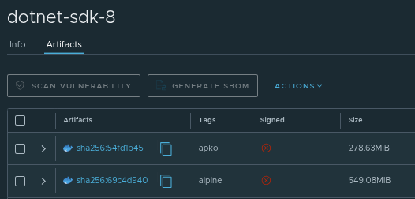

---
authors:
  - karlipe
date:
  created: 2025-09-10
  updated: 2025-09-10
categories:
  - CloudNative
tags:
  - distroless
  - melange
  - supply chain
readtime: 21
# draft: true
---

# **MELANGE: Criando seus próprios pacotes APK**

<figure markdown="span">
  
</figure>

O Melange é uma ferramenta de build de pacotes APK (formato utilizado pelo Alpine Linux). Se você já trabalhou com containers baseados em Alpine, sabe como a leveza e a simplicidade são pontos fortes — e como, ao mesmo tempo, pode ser um desafio adaptar pacotes para atender necessidades específicas. É aí que o Melange entra: ele permite que você crie e mantenha seus próprios pacotes, de forma reprodutível, automatizável e multi-arquitetura. Isso tudo de forma declarativa em um único arquivo **YAML**.

<!-- more -->

## **Porque Usar?**

Para times de DevOps e SREs, isso abre várias possibilidades práticas, como:

- Empacotar sua própria aplicação: por exemplo, transformar um projeto Python em um pacote APK instalável diretamente no seu ambiente.
- Criar um pacote daquela ferramenta que não existe pacote para Alpine, apenas aquele bom e velho **`.tar.gz`** e você tem que fazer a configuração e instalação manual após isso.
- Personalizar dependências padrão: imagine criar um pacote do .NET SDK que já traga os plugins necessários para o seu fluxo de trabalho em pipelines (evitando instalação recorrente durante o processo).
- Adicionar integrações internas: como embutir o certificado raiz da sua empresa em um pacote, garantindo que todos os containers usem o mesmo ponto de confiança sem gambiarras manuais.
- Como padronizar e distribuir software de forma segura, auditável e adaptada ao meu contexto.

A Página de documentação da [**Chainguard**](https://edu.chainguard.dev/open-source/build-tools/melange/getting-started-with-melange/) é bem completa e pode ajudar bastante a entender, utilizando alguns exemplos práticos. Inclusive nem é necessário instalar nada, pois a partir do proprio container do melange *(via docker run)* é possível criar esses pacotes.

## **Como Utilizar**

### **Pré-requisito**

- **Para Usuários Linux**:você irá precisar executar o comando abaixo pra adicionar headers no seu Kernel. Caso você tenha instalado "*Docker Desktop*", no caso de ***macOS***, este passo não será necessário

    ```shell title="Adding QEMU headers"
    docker run --rm --privileged multiarch/qemu-user-static --reset -p yes
    ```

- **Download da imagem**: Outro passo de boa prática mas não 100% necessário, porque indiretamente a imagem será baixada quando você executar de fato o comando, é baixar a ultima imagem disponível na sua máquina para que você consiga realizar alguns passos caso queira realizar de forma offline.

    ```shell title="Downloading Melange image"
    docker pull cgr.dev/chainguard/melange:latest
    ```

- **Gerar Certificado Próprio**: Uma boa prática é, antes de começar a criação dos seus pacotes, você criar uma pair de chaves rsa utilizando a mesma imagem

    ```bash title="Generate Certificate"
    $ docker run --rm -v "${PWD}":/work cgr.dev/chainguard/melange keygen

    2025/09/10 20:17:12 INFO generating keypair with a 4096 bit prime, please wait...
    2025/09/10 20:17:13 INFO wrote private key to melange.rsa
    2025/09/10 20:17:13 INFO wrote public key to melange.rsa.pub
    ```

## **Cenário Hipotético**

**Controlar a versão de SDK e Plugins!**

Imagine que sua empresa possui um pipeline parada cada API, e que nesse pipeline é instalado o **SDK** e alguns **Plugins** para execução de alguns steps de verificação básica de código, além do build da aplicação. ATUALMENTE, na maioria dos pipelines sempre está sendo instalado a latest e em outros esta 'mockada' uma versão antiga, porém você tem que manter de forma **controlada** a versão utilizada de cada SDK, assim como a versão de cada Plugin para garantir que todos estejam no mesmo passo, checando as mesmas coisas com o mesmo grau de compatibilidade. Tudo isso pensando em dupla Arquitetura: **X64 e ARM**.

Versões utilizadas para exemplo:

- [x] DotNet SDK 8 
    * [x] dotnet-sonarscanner (versão latest) (sem problemas de compatibilidade com o sonarqube)
    * [x] dotnet-coverage (versão 17.13.1) (problemas de compatibilidade com versão do SDK)
    * [x] Swashbuckle.AspNetCore.Cli (versão 7.2.0)

## **Exemplo Prático**


### **Criar Arquivo de Configuração**

Segue uma exemplificação de um arquivo .yaml que atende todas as necessidades citadas no cenário passado.

??? abstract "dotnet8-builder.yaml"
    ```yaml
    package:
      name: dotnet8-builder
      version: 8.0.413
      description: ".NET SDK 8.0 para Alpine Linux"
      copyright:
        - license: MIT
      dependencies:
        runtime:
          - ca-certificates-bundle
          - icu
          - icu-libs
          - libgcc
          - libintl
          - libgdiplus
          - libssl3
          - libstdc++

    environment:
      contents:
        repositories:
          - https://dl-cdn.alpinelinux.org/alpine/edge/main
          - https://dl-cdn.alpinelinux.org/alpine/edge/community
        packages:
          - bash
          - curl
          - icu
          - icu-libs
          - libgcc
          - libstdc++
          - tar

    pipeline:
      - runs: |
          mkdir -p /home/build/aspnet/

      - assertions:
          required-steps: 1
        pipeline:
          - uses: fetch
            if: ${{build.arch}} == 'aarch64'
            with:
              uri: https://builds.dotnet.microsoft.com/dotnet/Sdk/${{package.version}}/dotnet-sdk-${{package.version}}-linux-musl-arm64.tar.gz
              directory: /home/build/aspnet/
              strip-components: 0
              expected-sha512: 1380ddfdc715b831e459ee48636d8a2a89aa6c34857e4a428a63effcab40f88cf6c72a076f9b210c496c39bde24dd17c1db9f7b110e724174e39fb748f8e4b50

          - uses: fetch
            if: ${{build.arch}} == 'x86_64'
            with:
              uri: https://builds.dotnet.microsoft.com/dotnet/Sdk/${{package.version}}/dotnet-sdk-${{package.version}}-linux-musl-x64.tar.gz
              directory: /home/build/aspnet/
              strip-components: 0
              expected-sha512: 1490e8061d8665373506db3cbbf8a30b7b7d99884de02d4f6e7ace5852e16a4f9e061a668abec1cc0af21e4d5a3fa1eee804b60d249f7d568363bb9ee1abdab9
          
      - runs: |          
          # Create destination dir 
          mkdir -p "${{targets.destdir}}/usr/share/dotnet"
          mv /home/build/aspnet/* "${{targets.destdir}}/usr/share/dotnet"

          # Create symbolic link
          mkdir -p "${{targets.destdir}}/usr/bin"
          ln -s /usr/share/dotnet/dotnet "${{targets.destdir}}/usr/bin/dotnet"

          # Install paths (dotnet tools)
          export DOTNET_ROOT="${{targets.destdir}}/usr/share/dotnet"
          export PATH="$PATH:${{targets.destdir}}/usr/share/dotnet"

          # Verify dotnet Installation
          dotnet --info

          ###################### Tools 
          # Install SonarScanner
          dotnet tool install dotnet-sonarscanner \
            --tool-path ${{targets.destdir}}/usr/share/dotnet 

          # Install Coverage
          dotnet tool install dotnet-coverage --version 17.13.1 \
            --tool-path ${{targets.destdir}}/usr/share/dotnet 

          # Install Swashbuckle
          dotnet tool install Swashbuckle.AspNetCore.Cli --version 7.2.0 \
            --tool-path ${{targets.destdir}}/usr/share/dotnet 

          # remove useless packages
          find "${{targets.destdir}}/usr/share/dotnet/.store" -type d -path "*/any/ubuntu*" -exec rm -rf {} +
          
          if [ "${{ build.arch }}" = "aarch64" ]; then
            find "${{targets.destdir}}/usr/share/dotnet/.store" -type d -path "*/alpine/x64*" -exec rm -rf {} +
          elif [ "${{ build.arch }}" = "x86_64" ]; then
            find "${{targets.destdir}}/usr/share/dotnet/.store" -type d -path "*/alpine/arm64*" -exec rm -rf {} +
          else
            echo "Arquitetura diferente de aarch64/x86_64"
            exit 1
          fi

          # Check tool List Configuration
          dotnet tool list --tool-path ${{targets.destdir}}/usr/share/dotnet
    ```

#### Explicando as opções utilizadas:

- **Sections**
    - **name, version, description**, são auto explicativos.
    - **copyright**: é possivel especificar qual licença é a utilizada pelo pacote que você ta criando, para que seja reproduzível ou não com base em qual é utilizada.
        ```yaml hl_lines="2 3"
        ..
            copyright:
                - license: MIT
        ..

        ```
    - **dependencies**: Aqui deve ser referenciado a lista de pacotes 'pre-requisitos' para a instalação do seu pacote no ambiente que você esta criando.
        ```yaml hl_lines="2 3"
        ..
            dependencies:
                runtime:
                    - gcompat
                    ..
        ```
    - **environment**: a lista de pacotes necessários para criar o SEU pacote, durante o '***pipeline***' que será executado. E de qual repositório eles serão encontrados.
        ```yaml hl_lines="2 3 4 7"
        ..
            environment:
                contents:
                    repositories:
                        - https://dl-cdn.alpinelinux.org/alpine/edge/main
                        - https://dl-cdn.alpinelinux.org/alpine/edge/community
                    packages:
                        - bash
                        ..
        ```
    - **pipeline**: é onde fica a lista de passos que serão executados para construir o seu pacote.
        ```yaml hl_lines="2"
        ..
            pipeline:
                - runs: |
        ..
        ```
        - **runs**: quando o 'runs' é informado, é literalmente uma sequencia de comandos bash a serem executados, no caso a criação de um diretório.
            ```yaml hl_lines="2"
            ..
                - runs: |
                    mkdir -p /home/build/aspnet/
            ..
            ```
        - **assertions**: quando você tem condições a serem 'confirmadas', no caso é requirido que pelo menos 1 dos steps seja verdadeiro. Na sequência referenciamos um 'sub-pipeline' e usamos a função '**fetch**' com uma condição para cada ambiente, referenciando para qual link, qual diretório será realizado, se será descompactado(strip-components) e fazendo a checagem com o 'sha512' fornecido pela Microsoft.
            ```yaml hl_lines="2-5 13"
            ..
                - assertions:
                    required-steps: 1
                  pipeline:
                    - uses: fetch
                      if: ${{build.arch}} == 'aarch64'
                      with:
                        uri: https://builds.dotnet.microsoft.com/dotnet/Sdk/${{package.version}}/dotnet-sdk-${{package.version}}-linux-musl-arm64.tar.gz
                        directory: /home/build/aspnet/
                        strip-components: 0
                        expected-sha512: 1380ddfdc715b831e459ee48636d8a2a89aa6c34857e4a428a63effcab40f88cf6c72a076f9b210c496c39bde24dd17c1db9f7b110e724174e39fb748f8e4b50

                  - uses: fetch
                    if: ${{build.arch}} == 'x86_64'
                    .....
            ..
            ```
        - **runs**: quando o 'runs' é informado, é literalmente uma sequencia de comandos bash a serem executados, no caso a criação de um diretório.
            ```yaml hl_lines="2"
            ..
                - runs: |          
                    # Create destination dir 
                    ..
            ```

- **Parameters**
    - **${{build.arch}}**

        Qual arquitetura esta sendo referenciada durante a execução.

    - **${{package.version}}**

        É referente pelo parâmetro 'version', descrita no começo do arquivo.

    - **${{targets.destdir}}**

        Literalmente o destino de onde será instalado, o padrão de referenciado será './', caso isso não seja especificado poderá acontecer problemas de onde ele será executado caso a instalação seja feito de forma manual em um diretório não esperado.

### **Execução e Arquivos Gerados**

Para ***buildar*** o pacote, bastaria executar o comando abaixo. Nele podemos ver que está sendo referenciado quais arquiteturas serão utilizadas **`--arch amd64,aarch64`** e a chave privada gerada previamente **`--signing-key melange.rsa`**.

```bash title="Creating Package dotnet8-builder"
docker run --privileged --rm -v "${PWD}":/work \
  cgr.dev/chainguard/melange build dotnet8-builder.yaml \
  --arch amd64,aarch64 \
  --signing-key melange.rsa
```

Abaixo podemos ver os arquivos de pair-key e os arquivos gerados pela execução do build. Seguindo padrão de organização dos [**repositórios do Alpine**](https://dl-cdn.alpinelinux.org/alpine/edge/main/). Note que ele é separado por arquitetura (as mesmas que referenciamos), e que ele usa os parâmetros **`name`** e **`version`** referenciados no arquivo. Caso criassemos vários pacotes em sequência, automaticamente ele adicionaria as informações pertinentes no `APKINDEX.tar.gz` e alimentaria automaticamente 

```bash title="Directory Tree"
.
├── melange.rsa
├── melange.rsa.pub
├── packages
│   ├── aarch64
│   │   ├── APKINDEX.tar.gz
│   │   └── dotnet8-builder-8.0.413-r0.apk
│   └── x86_64
│       ├── APKINDEX.tar.gz
│       └── dotnet8-builder-8.0.413-r0.apk
└── dotnet8-builder.yaml
```

Segue tambem a saida dos logs dessa execução para que você possa analisar e ver como seria a forma da saída do comando executado.

??? abstract "Generated Logs"
    ```yaml
    2025/09/10 20:45:01 INFO melange v0.30.6+dirty is building: arch=aarch64
    2025/09/10 20:45:01 INFO melange v0.30.6+dirty is building: arch=x86_64
    2025/09/10 20:45:01 INFO populating workspace /tmp/melange-workspace-2663022281 from . arch=aarch64
    2025/09/10 20:45:01 INFO populating workspace /tmp/melange-workspace-284474888 from . arch=x86_64
    2025/09/10 20:45:08 INFO image configuration: arch=x86_64
    2025/09/10 20:45:08 INFO   contents: arch=x86_64
    2025/09/10 20:45:08 INFO     build repositories: [] arch=x86_64
    2025/09/10 20:45:08 INFO     runtime repositories: [] arch=x86_64
    2025/09/10 20:45:08 INFO     repositories: [https://dl-cdn.alpinelinux.org/alpine/edge/community https://dl-cdn.alpinelinux.org/alpine/edge/main] arch=x86_64
    2025/09/10 20:45:08 INFO     keyring:      [] arch=x86_64
    2025/09/10 20:45:08 INFO     packages:     [acl-libs=2.3.2-r1 bash=5.3.3-r1 brotli-libs=1.1.0-r2 busybox-binsh=1.37.0-r23 busybox=1.37.0-r23 c-ares=1.34.5-r0 ca-certificates-bundle=20250619-r0 curl=8.16.0-r0 icu-data-en=76.1-r1 icu-libs=76.1-r1 icu=76.1-r1 libcrypto3=3.5.2-r0 libcurl=8.16.0-r0 libgcc=15.2.0-r0 libidn2=2.3.8-r0 libncursesw=6.5_p20250816-r0 libpsl=0.21.5-r3 libssl3=3.5.2-r0 libstdc++=15.2.0-r0 libunistring=1.3-r0 musl=1.2.5-r20 ncurses-terminfo-base=6.5_p20250816-r0 nghttp2-libs=1.66.0-r0 nghttp3=1.9.0-r0 pcre2=10.46-r0 readline=8.3.1-r0 tar=1.35-r4 wget=1.25.0-r2 zlib=1.3.1-r2 zstd-libs=1.5.7-r2] arch=x86_64
    2025/09/10 20:45:08 INFO   accounts: arch=x86_64
    2025/09/10 20:45:08 INFO     runas:   arch=x86_64
    2025/09/10 20:45:08 INFO     users: arch=x86_64
    2025/09/10 20:45:08 INFO       - uid=1000(build) gid=1000 arch=x86_64
    2025/09/10 20:45:08 INFO     groups: arch=x86_64
    2025/09/10 20:45:08 INFO       - gid=1000(build) members=[build] arch=x86_64
    2025/09/10 20:45:08 INFO auth configured for: [] arch=x86_64
    2025/09/10 20:45:08 INFO image configuration: arch=aarch64
    2025/09/10 20:45:08 INFO   contents: arch=aarch64
    2025/09/10 20:45:08 INFO     build repositories: [] arch=aarch64
    2025/09/10 20:45:08 INFO     runtime repositories: [] arch=aarch64
    2025/09/10 20:45:08 INFO     repositories: [https://dl-cdn.alpinelinux.org/alpine/edge/community https://dl-cdn.alpinelinux.org/alpine/edge/main] arch=aarch64
    2025/09/10 20:45:08 INFO     keyring:      [] arch=aarch64
    2025/09/10 20:45:08 INFO     packages:     [acl-libs=2.3.2-r1 bash=5.3.3-r1 brotli-libs=1.1.0-r2 busybox-binsh=1.37.0-r23 busybox=1.37.0-r23 c-ares=1.34.5-r0 ca-certificates-bundle=20250619-r0 curl=8.16.0-r0 icu-data-en=76.1-r1 icu-libs=76.1-r1 icu=76.1-r1 libcrypto3=3.5.2-r0 libcurl=8.16.0-r0 libgcc=15.2.0-r0 libidn2=2.3.8-r0 libncursesw=6.5_p20250816-r0 libpsl=0.21.5-r3 libssl3=3.5.2-r0 libstdc++=15.2.0-r0 libunistring=1.3-r0 musl=1.2.5-r20 ncurses-terminfo-base=6.5_p20250816-r0 nghttp2-libs=1.66.0-r0 nghttp3=1.9.0-r0 pcre2=10.46-r0 readline=8.3.1-r0 tar=1.35-r4 wget=1.25.0-r2 zlib=1.3.1-r2 zstd-libs=1.5.7-r2] arch=aarch64
    2025/09/10 20:45:08 INFO   accounts: arch=aarch64
    2025/09/10 20:45:08 INFO     runas:   arch=aarch64
    2025/09/10 20:45:08 INFO     users: arch=aarch64
    2025/09/10 20:45:08 INFO       - uid=1000(build) gid=1000 arch=aarch64
    2025/09/10 20:45:08 INFO     groups: arch=aarch64
    2025/09/10 20:45:08 INFO       - gid=1000(build) members=[build] arch=aarch64
    2025/09/10 20:45:08 INFO auth configured for: [] arch=aarch64
    2025/09/10 20:45:10 INFO installing musl (1.2.5-r20) arch=x86_64
    2025/09/10 20:45:10 INFO installing acl-libs (2.3.2-r1) arch=x86_64
    2025/09/10 20:45:10 INFO installing busybox (1.37.0-r23) arch=x86_64
    2025/09/10 20:45:10 INFO installing busybox-binsh (1.37.0-r23) arch=x86_64
    2025/09/10 20:45:10 INFO installing ncurses-terminfo-base (6.5_p20250816-r0) arch=x86_64
    2025/09/10 20:45:10 INFO installing libncursesw (6.5_p20250816-r0) arch=x86_64
    2025/09/10 20:45:10 INFO installing readline (8.3.1-r0) arch=x86_64
    2025/09/10 20:45:10 INFO installing bash (5.3.3-r1) arch=x86_64
    2025/09/10 20:45:10 INFO installing brotli-libs (1.1.0-r2) arch=x86_64
    2025/09/10 20:45:10 INFO installing c-ares (1.34.5-r0) arch=x86_64
    2025/09/10 20:45:10 INFO installing ca-certificates-bundle (20250619-r0) arch=x86_64
    2025/09/10 20:45:10 INFO installing musl (1.2.5-r20) arch=aarch64
    2025/09/10 20:45:10 INFO installing acl-libs (2.3.2-r1) arch=aarch64
    2025/09/10 20:45:10 INFO installing busybox (1.37.0-r23) arch=aarch64
    2025/09/10 20:45:10 INFO installing busybox-binsh (1.37.0-r23) arch=aarch64
    2025/09/10 20:45:10 INFO installing ncurses-terminfo-base (6.5_p20250816-r0) arch=aarch64
    2025/09/10 20:45:10 INFO installing libncursesw (6.5_p20250816-r0) arch=aarch64
    2025/09/10 20:45:10 INFO installing readline (8.3.1-r0) arch=aarch64
    2025/09/10 20:45:10 INFO installing bash (5.3.3-r1) arch=aarch64
    2025/09/10 20:45:10 INFO installing brotli-libs (1.1.0-r2) arch=aarch64
    2025/09/10 20:45:10 INFO installing c-ares (1.34.5-r0) arch=aarch64
    2025/09/10 20:45:10 INFO installing ca-certificates-bundle (20250619-r0) arch=aarch64
    2025/09/10 20:45:10 INFO installing libcrypto3 (3.5.2-r0) arch=x86_64
    2025/09/10 20:45:10 INFO installing libunistring (1.3-r0) arch=x86_64
    2025/09/10 20:45:10 INFO installing libidn2 (2.3.8-r0) arch=x86_64
    2025/09/10 20:45:10 INFO installing nghttp2-libs (1.66.0-r0) arch=x86_64
    2025/09/10 20:45:10 INFO installing nghttp3 (1.9.0-r0) arch=x86_64
    2025/09/10 20:45:10 INFO installing libpsl (0.21.5-r3) arch=x86_64
    2025/09/10 20:45:10 INFO installing libssl3 (3.5.2-r0) arch=x86_64
    2025/09/10 20:45:10 INFO installing zlib (1.3.1-r2) arch=x86_64
    2025/09/10 20:45:10 INFO installing zstd-libs (1.5.7-r2) arch=x86_64
    2025/09/10 20:45:10 INFO installing libcurl (8.16.0-r0) arch=x86_64
    2025/09/10 20:45:10 INFO installing libcrypto3 (3.5.2-r0) arch=aarch64
    2025/09/10 20:45:10 INFO installing libunistring (1.3-r0) arch=aarch64
    2025/09/10 20:45:10 INFO installing libidn2 (2.3.8-r0) arch=aarch64
    2025/09/10 20:45:10 INFO installing nghttp2-libs (1.66.0-r0) arch=aarch64
    2025/09/10 20:45:10 INFO installing nghttp3 (1.9.0-r0) arch=aarch64
    2025/09/10 20:45:10 INFO installing libpsl (0.21.5-r3) arch=aarch64
    2025/09/10 20:45:10 INFO installing libssl3 (3.5.2-r0) arch=aarch64
    2025/09/10 20:45:10 INFO installing zlib (1.3.1-r2) arch=aarch64
    2025/09/10 20:45:10 INFO installing zstd-libs (1.5.7-r2) arch=aarch64
    2025/09/10 20:45:10 INFO installing libcurl (8.16.0-r0) arch=aarch64
    2025/09/10 20:45:10 INFO installing curl (8.16.0-r0) arch=aarch64
    2025/09/10 20:45:10 INFO installing curl (8.16.0-r0) arch=x86_64
    2025/09/10 20:45:10 INFO installing icu-data-en (76.1-r1) arch=x86_64
    2025/09/10 20:45:10 INFO installing libgcc (15.2.0-r0) arch=x86_64
    2025/09/10 20:45:10 INFO installing libstdc++ (15.2.0-r0) arch=x86_64
    2025/09/10 20:45:11 INFO installing icu-data-en (76.1-r1) arch=aarch64
    2025/09/10 20:45:11 INFO installing libgcc (15.2.0-r0) arch=aarch64
    2025/09/10 20:45:11 INFO installing libstdc++ (15.2.0-r0) arch=aarch64
    2025/09/10 20:45:11 INFO installing icu-libs (76.1-r1) arch=aarch64
    2025/09/10 20:45:11 INFO installing icu (76.1-r1) arch=aarch64
    2025/09/10 20:45:11 INFO installing pcre2 (10.46-r0) arch=aarch64
    2025/09/10 20:45:11 INFO installing tar (1.35-r4) arch=aarch64
    2025/09/10 20:45:11 INFO installing wget (1.25.0-r2) arch=aarch64
    2025/09/10 20:45:11 WARN /etc/os-release is missing arch=aarch64
    2025/09/10 20:45:11 INFO installing icu-libs (76.1-r1) arch=x86_64
    2025/09/10 20:45:11 INFO installing icu (76.1-r1) arch=x86_64
    2025/09/10 20:45:11 INFO installing pcre2 (10.46-r0) arch=x86_64
    2025/09/10 20:45:11 INFO installing tar (1.35-r4) arch=x86_64
    2025/09/10 20:45:11 INFO installing wget (1.25.0-r2) arch=x86_64
    2025/09/10 20:45:11 WARN /etc/os-release is missing arch=x86_64
    2025/09/10 20:45:11 INFO running step "fetch" arch=x86_64
    2025/09/10 20:45:11 WARN --2025-09-10 20:45:11--  https://builds.dotnet.microsoft.com/dotnet/Sdk/8.0.413/dotnet-sdk-8.0.413-linux-musl-x64.tar.gz arch=x86_64
    2025/09/10 20:45:11 INFO running step "fetch" arch=aarch64
    2025/09/10 20:45:11 WARN --2025-09-10 20:45:11--  https://builds.dotnet.microsoft.com/dotnet/Sdk/8.0.413/dotnet-sdk-8.0.413-linux-musl-arm64.tar.gz arch=aarch64
    2025/09/10 20:45:11 WARN Resolving builds.dotnet.microsoft.com (builds.dotnet.microsoft.com)... 23.53.35.241, 23.53.35.228, 2600:1408:ec00:15::17d7:cc, ... arch=x86_64
    2025/09/10 20:45:11 WARN Connecting to builds.dotnet.microsoft.com (builds.dotnet.microsoft.com)|23.53.35.241|:443... connected. arch=x86_64
    2025/09/10 20:45:11 WARN Resolving builds.dotnet.microsoft.com (builds.dotnet.microsoft.com)... 23.53.35.71, 23.53.35.68, 2600:1408:ec00:15::17d7:cc, ... arch=aarch64
    2025/09/10 20:45:11 WARN Connecting to builds.dotnet.microsoft.com (builds.dotnet.microsoft.com)|23.53.35.71|:443... connected. arch=aarch64
    2025/09/10 20:45:12 WARN HTTP request sent, awaiting response... 200 OK arch=x86_64
    2025/09/10 20:45:12 WARN Length: 216249095 (206M) [application/octet-stream] arch=x86_64
    2025/09/10 20:45:12 WARN Saving to: 'dotnet-sdk-8.0.413-linux-musl-x64.tar.gz' arch=x86_64
    2025/09/10 20:45:12 WARN arch=x86_64
    2025/09/10 20:45:12 WARN      0K .......... .......... .......... .......... ..........  0% 1.11M 3m6s arch=x86_64
    2025/09/10 20:45:12 WARN HTTP request sent, awaiting response... 200 OK arch=aarch64
    2025/09/10 20:45:12 WARN Length: 211421059 (202M) [application/octet-stream] arch=aarch64
    2025/09/10 20:45:12 WARN Saving to: 'dotnet-sdk-8.0.413-linux-musl-arm64.tar.gz' arch=aarch64
    2025/09/10 20:45:12 WARN arch=aarch64
    2025/09/10 20:45:12 WARN     50K .......... .......... .......... .......... ..........  0%  218K 9m37s arch=x86_64
    2025/09/10 20:45:12 WARN    100K .......... .......... .......... .......... ..........  0%  978K 7m36s arch=x86_64
    .....
    2025/09/10 20:49:55 WARN 210850K .......... .......... .......... .......... .......... 99% 7.80M 0s arch=x86_64
    2025/09/10 20:49:55 WARN 210900K .......... .......... .......... .......... .......... 99% 21.9M 0s arch=x86_64
    2025/09/10 20:49:55 WARN 210950K .......... .......... .......... .......... .......... 99% 12.4M 0s arch=x86_64
    2025/09/10 20:49:55 WARN 211000K .......... .......... .......... .......... .......... 99% 15.6M 0s arch=x86_64
    2025/09/10 20:49:55 WARN 211050K .......... .......... .......... .......... .......... 99% 19.1M 0s arch=x86_64
    2025/09/10 20:49:55 WARN 211100K .......... .......... .......... .......... .......... 99% 6.31M 0s arch=x86_64
    2025/09/10 20:49:55 WARN 211150K .......... .......... ..........                      100%  199M=57s arch=x86_64
    2025/09/10 20:49:55 WARN arch=x86_64
    2025/09/10 20:49:55 WARN 2025-09-10 20:49:55 (3.62 MB/s) - 'dotnet-sdk-8.0.413-linux-musl-x64.tar.gz' saved [216249095/216249095] arch=x86_64
    2025/09/10 20:49:55 WARN arch=x86_64
    2025/09/10 20:49:55 INFO fetch: Expected sha512: 1490e8061d8665373506db3cbbf8a30b7b7d99884de02d4f6e7ace5852e16a4f9e061a668abec1cc0af21e4d5a3fa1eee804b60d249f7d568363bb9ee1abdab9 arch=x86_64
    2025/09/10 20:50:02 INFO .NET SDK: arch=x86_64
    2025/09/10 20:50:02 INFO  Version:           8.0.413 arch=x86_64
    2025/09/10 20:50:02 INFO  Commit:            a31823e79b arch=x86_64
    2025/09/10 20:50:02 INFO  Workload version:  8.0.400-manifests.6322a93a arch=x86_64
    2025/09/10 20:50:02 INFO  MSBuild version:   17.11.38+901dc04e4 arch=x86_64
    2025/09/10 20:50:02 INFO arch=x86_64
    2025/09/10 20:50:02 INFO Runtime Environment: arch=x86_64
    2025/09/10 20:50:02 INFO  OS Name:     Linux arch=x86_64
    2025/09/10 20:50:02 INFO  OS Version:   arch=x86_64
    2025/09/10 20:50:02 INFO  OS Platform: Linux arch=x86_64
    2025/09/10 20:50:02 INFO  RID:         linux-musl-x64 arch=x86_64
    2025/09/10 20:50:02 INFO  Base Path:   /home/build/melange-out/dotnet8-builder/usr/share/dotnet/sdk/8.0.413/ arch=x86_64
    2025/09/10 20:50:02 INFO arch=x86_64
    2025/09/10 20:50:02 INFO .NET workloads installed: arch=x86_64
    2025/09/10 20:50:02 INFO Configured to use loose manifests when installing new manifests. arch=x86_64
    2025/09/10 20:50:02 INFO There are no installed workloads to display. arch=x86_64
    2025/09/10 20:50:02 INFO arch=x86_64
    2025/09/10 20:50:02 INFO Host: arch=x86_64
    2025/09/10 20:50:02 INFO   Version:      8.0.19 arch=x86_64
    2025/09/10 20:50:02 INFO   Architecture: x64 arch=x86_64
    2025/09/10 20:50:02 INFO   Commit:       fce8ed90dc arch=x86_64
    2025/09/10 20:50:02 INFO arch=x86_64
    2025/09/10 20:50:02 INFO .NET SDKs installed: arch=x86_64
    2025/09/10 20:50:02 INFO   8.0.413 [/home/build/melange-out/dotnet8-builder/usr/share/dotnet/sdk] arch=x86_64
    2025/09/10 20:50:02 INFO arch=x86_64
    2025/09/10 20:50:02 INFO .NET runtimes installed: arch=x86_64
    2025/09/10 20:50:02 INFO   Microsoft.AspNetCore.App 8.0.19 [/home/build/melange-out/dotnet8-builder/usr/share/dotnet/shared/Microsoft.AspNetCore.App] arch=x86_64
    2025/09/10 20:50:02 INFO   Microsoft.NETCore.App 8.0.19 [/home/build/melange-out/dotnet8-builder/usr/share/dotnet/shared/Microsoft.NETCore.App] arch=x86_64
    2025/09/10 20:50:02 INFO arch=x86_64
    2025/09/10 20:50:02 INFO Other architectures found: arch=x86_64
    2025/09/10 20:50:02 INFO   None arch=x86_64
    2025/09/10 20:50:02 INFO arch=x86_64
    2025/09/10 20:50:02 INFO Environment variables: arch=x86_64
    2025/09/10 20:50:02 INFO   DOTNET_ROOT       [/home/build/melange-out/dotnet8-builder/usr/share/dotnet] arch=x86_64
    2025/09/10 20:50:02 INFO arch=x86_64
    2025/09/10 20:50:02 INFO global.json file: arch=x86_64
    2025/09/10 20:50:02 INFO   Not found arch=x86_64
    2025/09/10 20:50:02 INFO arch=x86_64
    2025/09/10 20:50:02 INFO Learn more: arch=x86_64
    2025/09/10 20:50:02 INFO   https://aka.ms/dotnet/info arch=x86_64
    2025/09/10 20:50:02 INFO arch=x86_64
    2025/09/10 20:50:02 INFO Download .NET: arch=x86_64
    2025/09/10 20:50:02 INFO   https://aka.ms/dotnet/download arch=x86_64
    2025/09/10 20:50:02 INFO arch=x86_64
    arch=x86_640:50:02 INFO Welcome to .NET 8.0!
    arch=x86_640:50:02 INFO ---------------------
    2025/09/10 20:50:02 INFO SDK Version: 8.0.413 arch=x86_64
    2025/09/10 20:50:02 INFO arch=x86_64
    arch=x86_640:50:02 INFO Telemetry
    arch=x86_640:50:02 INFO ---------
    2025/09/10 20:50:02 INFO The .NET tools collect usage data in order to help us improve your experience. It is collected by Microsoft and shared with the comm arch=x86_64an opt-out of telemetry by setting the DOTNET_CLI_TELEMETRY_OPTOUT environment variable to '1' or 'true' using your favorite shell.
    arch=x86_640:50:02 INFO 
    2025/09/10 20:50:02 INFO Read more about .NET CLI Tools telemetry: https://aka.ms/dotnet-cli-telemetry arch=x86_64
    2025/09/10 20:50:02 INFO arch=x86_64
    arch=x86_640:50:02 INFO ----------------
    arch=x86_640:50:02 INFO Installed an ASP.NET Core HTTPS development certificate.
    2025/09/10 20:50:02 INFO To trust the certificate, view the instructions: https://aka.ms/dotnet-https-linux arch=x86_64
    2025/09/10 20:50:02 INFO arch=x86_64
    arch=x86_640:50:02 INFO ----------------
    arch=x86_640:50:02 INFO Write your first app: https://aka.ms/dotnet-hello-world
    arch=x86_640:50:02 INFO Find out what's new: https://aka.ms/dotnet-whats-new
    arch=x86_640:50:02 INFO Explore documentation: https://aka.ms/dotnet-docs
    arch=x86_640:50:02 INFO Report issues and find source on GitHub: https://github.com/dotnet/core
    arch=x86_640:50:02 INFO Use 'dotnet --help' to see available commands or visit: https://aka.ms/dotnet-cli
    2025/09/10 20:50:02 INFO -------------------------------------------------------------------------------------- arch=x86_64
    arch=x86_640:50:05 INFO You can invoke the tool using the following command: dotnet-sonarscanner
    2025/09/10 20:50:05 INFO Tool 'dotnet-sonarscanner' (version '10.3.0') was successfully installed. arch=x86_64
    arch=x86_640:50:09 INFO You can invoke the tool using the following command: dotnet-coverage
    2025/09/10 20:50:09 INFO Tool 'dotnet-coverage' (version '17.14.2') was successfully installed. arch=x86_64
    arch=x86_640:50:10 INFO You can invoke the tool using the following command: swagger
    2025/09/10 20:50:10 INFO Tool 'swashbuckle.aspnetcore.cli' (version '7.2.0') was successfully installed. arch=x86_64
    2025/09/10 20:50:11 INFO Package Id                      Version      Commands            arch=x86_64
    2025/09/10 20:50:11 INFO ---------------------------------------------------------------- arch=x86_64
    2025/09/10 20:50:11 INFO dotnet-coverage                 17.14.2      dotnet-coverage     arch=x86_64
    2025/09/10 20:50:11 INFO dotnet-sonarscanner             10.3.0       dotnet-sonarscanner arch=x86_64
    2025/09/10 20:50:11 INFO swashbuckle.aspnetcore.cli      7.2.0        swagger             arch=x86_64
    2025/09/10 20:50:11 INFO retrieving workspace from builder:  arch=x86_64
    2025/09/10 20:50:11 WARN cat: can't open '/etc/os-release': No such file or directory arch=x86_64
    2025/09/10 20:50:11 WARN failed to retrieve release data from runner, OS section will be unknown: failed to read os-release: exit status 1 arch=x86_64
    2025/09/10 20:50:11 INFO retrieved and wrote post-build workspace to: /tmp/melange-workspace-671198310 arch=x86_64
    2025/09/10 20:50:11 INFO running package linters for dotnet8-builder arch=x86_64
    2025/09/10 20:50:11 INFO linting apk: dotnet8-builder arch=x86_64
    2025/09/10 20:50:11 WARN linter "lddcheck" failed on package "dotnet8-builder": shared object found: usr/share/dotnet/.store/dotnet-coverage/17.14.2/dotnet-coverage/17.14.2/tools/net8.0/any/alpine/x64/libCoverageInstrumentationMethod.so; suggest: This package provides shared object files, please add the ldd-check test pipeline arch=x86_64
    2025/09/10 20:50:11 INFO checking license information arch=x86_64
    2025/09/10 20:50:11 INFO no license files detected arch=x86_64
    2025/09/10 20:50:11 WARN SPDXRef-Package-dotnet8-builder-8.0.413-r0: no license specified, defaulting to NOASSERTION arch=x86_64
    2025/09/10 20:50:11 WARN invalid license: NOASSERTION arch=x86_64
    2025/09/10 20:50:11 INFO writing SBOM for dotnet8-builder arch=x86_64
    2025/09/10 20:50:11 INFO generating package dotnet8-builder-8.0.413-r0 arch=x86_64
    2025/09/10 20:50:11 INFO scanning for ld.so.conf.d files... arch=x86_64
    2025/09/10 20:50:11 INFO scanning for shared object dependencies... arch=x86_64
    2025/09/10 20:50:11 INFO   found lib libstdc++.so.6 for usr/share/dotnet/.store/dotnet-coverage/17.14.2/dotnet-coverage/17.14.2/tools/net8.0/any/alpine/x64/libCoverageInstrumentationMethod.so arch=x86_64
    2025/09/10 20:50:11 INFO   found lib libgcc_s.so.1 for usr/share/dotnet/.store/dotnet-coverage/17.14.2/dotnet-coverage/17.14.2/tools/net8.0/any/alpine/x64/libCoverageInstrumentationMethod.so arch=x86_64
    2025/09/10 20:50:11 INFO   found lib libc.musl-x86_64.so.1 for usr/share/dotnet/.store/dotnet-coverage/17.14.2/dotnet-coverage/17.14.2/tools/net8.0/any/alpine/x64/libCoverageInstrumentationMethod.so arch=x86_64
    2025/09/10 20:50:11 INFO   found lib libintl.so.8 for usr/share/dotnet/.store/dotnet-coverage/17.14.2/dotnet-coverage/17.14.2/tools/net8.0/any/alpine/x64/libInstrumentationEngine.so arch=x86_64
    2025/09/10 20:50:11 INFO   found lib libstdc++.so.6 for usr/share/dotnet/.store/dotnet-coverage/17.14.2/dotnet-coverage/17.14.2/tools/net8.0/any/alpine/x64/libInstrumentationEngine.so arch=x86_64
    2025/09/10 20:50:11 INFO   found lib libxml2.so.2 for usr/share/dotnet/.store/dotnet-coverage/17.14.2/dotnet-coverage/17.14.2/tools/net8.0/any/alpine/x64/libInstrumentationEngine.so arch=x86_64
    2025/09/10 20:50:11 INFO   found lib libgcc_s.so.1 for usr/share/dotnet/.store/dotnet-coverage/17.14.2/dotnet-coverage/17.14.2/tools/net8.0/any/alpine/x64/libInstrumentationEngine.so arch=x86_64
    2025/09/10 20:50:11 INFO   found lib libc.musl-x86_64.so.1 for usr/share/dotnet/.store/dotnet-coverage/17.14.2/dotnet-coverage/17.14.2/tools/net8.0/any/alpine/x64/libInstrumentationEngine.so arch=x86_64
    2025/09/10 20:50:11 INFO interpreter for dotnet => /lib/ld-musl-x86_64.so.1 arch=x86_64
    2025/09/10 20:50:11 INFO   found lib libstdc++.so.6 for usr/share/dotnet/dotnet arch=x86_64
    2025/09/10 20:50:11 INFO   found lib libgcc_s.so.1 for usr/share/dotnet/dotnet arch=x86_64
    2025/09/10 20:50:11 INFO   found lib libc.musl-x86_64.so.1 for usr/share/dotnet/dotnet arch=x86_64
    2025/09/10 20:50:11 INFO interpreter for dotnet-coverage => /lib/ld-musl-x86_64.so.1 arch=x86_64
    2025/09/10 20:50:11 INFO   found lib libstdc++.so.6 for usr/share/dotnet/dotnet-coverage arch=x86_64
    2025/09/10 20:50:11 INFO   found lib libgcc_s.so.1 for usr/share/dotnet/dotnet-coverage arch=x86_64
    2025/09/10 20:50:11 INFO   found lib libc.musl-x86_64.so.1 for usr/share/dotnet/dotnet-coverage arch=x86_64
    2025/09/10 20:50:11 INFO interpreter for dotnet-sonarscanner => /lib/ld-musl-x86_64.so.1 arch=x86_64
    2025/09/10 20:50:11 INFO   found lib libstdc++.so.6 for usr/share/dotnet/dotnet-sonarscanner arch=x86_64
    2025/09/10 20:50:11 INFO   found lib libgcc_s.so.1 for usr/share/dotnet/dotnet-sonarscanner arch=x86_64
    2025/09/10 20:50:11 INFO   found lib libc.musl-x86_64.so.1 for usr/share/dotnet/dotnet-sonarscanner arch=x86_64
    2025/09/10 20:50:11 INFO   found lib libstdc++.so.6 for usr/share/dotnet/host/fxr/8.0.19/libhostfxr.so arch=x86_64
    2025/09/10 20:50:11 INFO   found lib libgcc_s.so.1 for usr/share/dotnet/host/fxr/8.0.19/libhostfxr.so arch=x86_64
    2025/09/10 20:50:11 INFO   found lib libc.musl-x86_64.so.1 for usr/share/dotnet/host/fxr/8.0.19/libhostfxr.so arch=x86_64
    2025/09/10 20:50:11 INFO interpreter for apphost => /lib/ld-musl-x86_64.so.1 arch=x86_64
    2025/09/10 20:50:11 INFO   found lib libstdc++.so.6 for usr/share/dotnet/packs/Microsoft.NETCore.App.Host.linux-musl-x64/8.0.19/runtimes/linux-musl-x64/native/apphost arch=x86_64
    2025/09/10 20:50:11 INFO   found lib libgcc_s.so.1 for usr/share/dotnet/packs/Microsoft.NETCore.App.Host.linux-musl-x64/8.0.19/runtimes/linux-musl-x64/native/apphost arch=x86_64
    2025/09/10 20:50:11 INFO   found lib libc.musl-x86_64.so.1 for usr/share/dotnet/packs/Microsoft.NETCore.App.Host.linux-musl-x64/8.0.19/runtimes/linux-musl-x64/native/apphost arch=x86_64
    2025/09/10 20:50:11 INFO   found lib libstdc++.so.6 for usr/share/dotnet/packs/Microsoft.NETCore.App.Host.linux-musl-x64/8.0.19/runtimes/linux-musl-x64/native/libnethost.so arch=x86_64
    2025/09/10 20:50:11 INFO   found lib libgcc_s.so.1 for usr/share/dotnet/packs/Microsoft.NETCore.App.Host.linux-musl-x64/8.0.19/runtimes/linux-musl-x64/native/libnethost.so arch=x86_64
    2025/09/10 20:50:11 INFO   found lib libc.musl-x86_64.so.1 for usr/share/dotnet/packs/Microsoft.NETCore.App.Host.linux-musl-x64/8.0.19/runtimes/linux-musl-x64/native/libnethost.so arch=x86_64
    2025/09/10 20:50:11 INFO interpreter for singlefilehost => /lib/ld-musl-x86_64.so.1 arch=x86_64
    2025/09/10 20:50:11 INFO   found lib libz.so.1 for usr/share/dotnet/packs/Microsoft.NETCore.App.Host.linux-musl-x64/8.0.19/runtimes/linux-musl-x64/native/singlefilehost arch=x86_64
    2025/09/10 20:50:11 INFO   found lib libgcc_s.so.1 for usr/share/dotnet/packs/Microsoft.NETCore.App.Host.linux-musl-x64/8.0.19/runtimes/linux-musl-x64/native/singlefilehost arch=x86_64
    2025/09/10 20:50:11 INFO   found lib libstdc++.so.6 for usr/share/dotnet/packs/Microsoft.NETCore.App.Host.linux-musl-x64/8.0.19/runtimes/linux-musl-x64/native/singlefilehost arch=x86_64
    2025/09/10 20:50:11 INFO   found lib libc.musl-x86_64.so.1 for usr/share/dotnet/packs/Microsoft.NETCore.App.Host.linux-musl-x64/8.0.19/runtimes/linux-musl-x64/native/singlefilehost arch=x86_64
    2025/09/10 20:50:11 INFO interpreter for apphost => /lib/ld-musl-x86_64.so.1 arch=x86_64
    2025/09/10 20:50:11 INFO   found lib libstdc++.so.6 for usr/share/dotnet/sdk/8.0.413/AppHostTemplate/apphost arch=x86_64
    2025/09/10 20:50:11 INFO   found lib libgcc_s.so.1 for usr/share/dotnet/sdk/8.0.413/AppHostTemplate/apphost arch=x86_64
    2025/09/10 20:50:11 INFO   found lib libc.musl-x86_64.so.1 for usr/share/dotnet/sdk/8.0.413/AppHostTemplate/apphost arch=x86_64
    2025/09/10 20:50:11 INFO interpreter for createdump => /lib/ld-musl-x86_64.so.1 arch=x86_64
    2025/09/10 20:50:11 INFO   found lib libstdc++.so.6 for usr/share/dotnet/shared/Microsoft.NETCore.App/8.0.19/createdump arch=x86_64
    2025/09/10 20:50:11 INFO   found lib libgcc_s.so.1 for usr/share/dotnet/shared/Microsoft.NETCore.App/8.0.19/createdump arch=x86_64
    2025/09/10 20:50:11 INFO   found lib libc.musl-x86_64.so.1 for usr/share/dotnet/shared/Microsoft.NETCore.App/8.0.19/createdump arch=x86_64
    2025/09/10 20:50:11 INFO   found lib libc.musl-x86_64.so.1 for usr/share/dotnet/shared/Microsoft.NETCore.App/8.0.19/libSystem.Globalization.Native.so arch=x86_64
    2025/09/10 20:50:11 INFO   found lib libz.so.1 for usr/share/dotnet/shared/Microsoft.NETCore.App/8.0.19/libSystem.IO.Compression.Native.so arch=x86_64
    2025/09/10 20:50:11 INFO   found lib libc.musl-x86_64.so.1 for usr/share/dotnet/shared/Microsoft.NETCore.App/8.0.19/libSystem.IO.Compression.Native.so arch=x86_64
    2025/09/10 20:50:11 INFO   found lib libc.musl-x86_64.so.1 for usr/share/dotnet/shared/Microsoft.NETCore.App/8.0.19/libSystem.Native.so arch=x86_64
    2025/09/10 20:50:11 INFO   found lib libc.musl-x86_64.so.1 for usr/share/dotnet/shared/Microsoft.NETCore.App/8.0.19/libSystem.Net.Security.Native.so arch=x86_64
    2025/09/10 20:50:11 INFO   found lib libc.musl-x86_64.so.1 for usr/share/dotnet/shared/Microsoft.NETCore.App/8.0.19/libSystem.Security.Cryptography.Native.OpenSsl.so arch=x86_64
    2025/09/10 20:50:11 INFO   found lib libstdc++.so.6 for usr/share/dotnet/shared/Microsoft.NETCore.App/8.0.19/libclrgc.so arch=x86_64
    2025/09/10 20:50:11 INFO   found lib libgcc_s.so.1 for usr/share/dotnet/shared/Microsoft.NETCore.App/8.0.19/libclrgc.so arch=x86_64
    2025/09/10 20:50:11 INFO   found lib libc.musl-x86_64.so.1 for usr/share/dotnet/shared/Microsoft.NETCore.App/8.0.19/libclrgc.so arch=x86_64
    2025/09/10 20:50:11 INFO   found lib libgcc_s.so.1 for usr/share/dotnet/shared/Microsoft.NETCore.App/8.0.19/libclrjit.so arch=x86_64
    2025/09/10 20:50:11 INFO   found lib libstdc++.so.6 for usr/share/dotnet/shared/Microsoft.NETCore.App/8.0.19/libclrjit.so arch=x86_64
    2025/09/10 20:50:11 INFO   found lib libc.musl-x86_64.so.1 for usr/share/dotnet/shared/Microsoft.NETCore.App/8.0.19/libclrjit.so arch=x86_64
    2025/09/10 20:50:11 INFO   found lib libgcc_s.so.1 for usr/share/dotnet/shared/Microsoft.NETCore.App/8.0.19/libcoreclr.so arch=x86_64
    2025/09/10 20:50:11 INFO   found lib libstdc++.so.6 for usr/share/dotnet/shared/Microsoft.NETCore.App/8.0.19/libcoreclr.so arch=x86_64
    2025/09/10 20:50:11 INFO   found lib libc.musl-x86_64.so.1 for usr/share/dotnet/shared/Microsoft.NETCore.App/8.0.19/libcoreclr.so arch=x86_64
    2025/09/10 20:50:11 INFO   found lib liblttng-ust.so.0 for usr/share/dotnet/shared/Microsoft.NETCore.App/8.0.19/libcoreclrtraceptprovider.so arch=x86_64
    2025/09/10 20:50:11 INFO   found lib libstdc++.so.6 for usr/share/dotnet/shared/Microsoft.NETCore.App/8.0.19/libcoreclrtraceptprovider.so arch=x86_64
    2025/09/10 20:50:11 INFO   found lib libgcc_s.so.1 for usr/share/dotnet/shared/Microsoft.NETCore.App/8.0.19/libcoreclrtraceptprovider.so arch=x86_64
    2025/09/10 20:50:11 INFO   found lib libc.musl-x86_64.so.1 for usr/share/dotnet/shared/Microsoft.NETCore.App/8.0.19/libcoreclrtraceptprovider.so arch=x86_64
    2025/09/10 20:50:11 INFO   found lib libstdc++.so.6 for usr/share/dotnet/shared/Microsoft.NETCore.App/8.0.19/libhostpolicy.so arch=x86_64
    2025/09/10 20:50:11 INFO   found lib libgcc_s.so.1 for usr/share/dotnet/shared/Microsoft.NETCore.App/8.0.19/libhostpolicy.so arch=x86_64
    2025/09/10 20:50:11 INFO   found lib libc.musl-x86_64.so.1 for usr/share/dotnet/shared/Microsoft.NETCore.App/8.0.19/libhostpolicy.so arch=x86_64
    2025/09/10 20:50:11 INFO   found lib libgcc_s.so.1 for usr/share/dotnet/shared/Microsoft.NETCore.App/8.0.19/libmscordaccore.so arch=x86_64
    2025/09/10 20:50:11 INFO   found lib libstdc++.so.6 for usr/share/dotnet/shared/Microsoft.NETCore.App/8.0.19/libmscordaccore.so arch=x86_64
    2025/09/10 20:50:11 INFO   found lib libc.musl-x86_64.so.1 for usr/share/dotnet/shared/Microsoft.NETCore.App/8.0.19/libmscordaccore.so arch=x86_64
    2025/09/10 20:50:11 INFO   found lib libstdc++.so.6 for usr/share/dotnet/shared/Microsoft.NETCore.App/8.0.19/libmscordbi.so arch=x86_64
    2025/09/10 20:50:11 INFO   found lib libgcc_s.so.1 for usr/share/dotnet/shared/Microsoft.NETCore.App/8.0.19/libmscordbi.so arch=x86_64
    2025/09/10 20:50:11 INFO   found lib libc.musl-x86_64.so.1 for usr/share/dotnet/shared/Microsoft.NETCore.App/8.0.19/libmscordbi.so arch=x86_64
    2025/09/10 20:50:11 INFO interpreter for swagger => /lib/ld-musl-x86_64.so.1 arch=x86_64
    2025/09/10 20:50:11 INFO   found lib libstdc++.so.6 for usr/share/dotnet/swagger arch=x86_64
    2025/09/10 20:50:11 INFO   found lib libgcc_s.so.1 for usr/share/dotnet/swagger arch=x86_64
    2025/09/10 20:50:11 INFO   found lib libc.musl-x86_64.so.1 for usr/share/dotnet/swagger arch=x86_64
    2025/09/10 20:50:11 INFO scanning for commands... arch=x86_64
    2025/09/10 20:50:11 INFO scanning for -doc package... arch=x86_64
    2025/09/10 20:50:11 INFO scanning for pkg-config data... arch=x86_64
    2025/09/10 20:50:11 INFO scanning for python modules... arch=x86_64
    2025/09/10 20:50:11 INFO scanning for ruby gems... arch=x86_64
    2025/09/10 20:50:11 INFO scanning for shbang deps... arch=x86_64
    2025/09/10 20:50:11 INFO   runtime: arch=x86_64
    2025/09/10 20:50:11 INFO     gcompat arch=x86_64
    2025/09/10 20:50:11 INFO     icu-libs>=76 arch=x86_64
    2025/09/10 20:50:11 INFO     icu>=76 arch=x86_64
    2025/09/10 20:50:11 INFO     libintl arch=x86_64
    2025/09/10 20:50:11 INFO     lttng-ust-dev=2.12.0-r3 arch=x86_64
    2025/09/10 20:50:11 INFO     lttng-ust=2.12.0-r3 arch=x86_64
    2025/09/10 20:50:11 INFO     musl arch=x86_64
    2025/09/10 20:50:11 INFO     so:libc.musl-x86_64.so.1 arch=x86_64
    2025/09/10 20:50:11 INFO     so:libgcc_s.so.1 arch=x86_64
    2025/09/10 20:50:11 INFO     so:libintl.so.8 arch=x86_64
    2025/09/10 20:50:11 INFO     so:liblttng-ust.so.0 arch=x86_64
    2025/09/10 20:50:11 INFO     so:libstdc++.so.6 arch=x86_64
    2025/09/10 20:50:11 INFO     so:libxml2.so.2 arch=x86_64
    2025/09/10 20:50:11 INFO     so:libz.so.1 arch=x86_64
    2025/09/10 20:50:11 INFO     userspace-rcu-dev=0.12.2-r0 arch=x86_64
    2025/09/10 20:50:11 INFO     userspace-rcu=0.12.2-r0 arch=x86_64
    2025/09/10 20:50:11 INFO   installed-size: 672421235 arch=x86_64
    2025/09/10 20:50:14 INFO   data.tar.gz digest: bfb6d2f1b8f85b5700c53e5aafb97c265a4a1d41c2190804952b582ec98f2ac7 arch=x86_64
    2025/09/10 20:50:24 INFO wrote packages/x86_64/dotnet8-builder-8.0.413-r0.apk arch=x86_64
    2025/09/10 20:50:24 INFO cleaning Workspace by removing 15 file/directories in /home/build arch=x86_64
    2025/09/10 20:50:24 INFO generating apk index from packages in packages/x86_64 arch=x86_64
    2025/09/10 20:50:24 INFO processing package packages/x86_64/dotnet8-builder-8.0.413-r0.apk arch=x86_64
    2025/09/10 20:50:24 INFO loaded 1/1 packages from index packages/x86_64/APKINDEX.tar.gz arch=x86_64
    2025/09/10 20:50:24 INFO updating index at packages/x86_64/APKINDEX.tar.gz with new packages: [dotnet8-builder-8.0.413-r0] arch=x86_64
    2025/09/10 20:50:24 INFO signing apk index at packages/x86_64/APKINDEX.tar.gz arch=x86_64
    2025/09/10 20:50:24 INFO signing index packages/x86_64/APKINDEX.tar.gz with key melange.rsa arch=x86_64
    2025/09/10 20:50:24 INFO appending signature RSA256 to index packages/x86_64/APKINDEX.tar.gz arch=x86_64
    2025/09/10 20:50:24 INFO writing signed index to packages/x86_64/APKINDEX.tar.gz arch=x86_64
    2025/09/10 20:50:24 INFO signed index packages/x86_64/APKINDEX.tar.gz with key melange.rsa arch=x86_64
    2025/09/10 20:50:27 INFO .NET SDK: arch=aarch64
    2025/09/10 20:50:27 INFO  Version:           8.0.413 arch=aarch64
    2025/09/10 20:50:27 INFO  Commit:            a31823e79b arch=aarch64
    2025/09/10 20:50:28 INFO  Workload version:  8.0.400-manifests.6322a93a arch=aarch64
    2025/09/10 20:50:28 INFO  MSBuild version:   17.11.38+901dc04e4 arch=aarch64
    2025/09/10 20:50:28 INFO arch=aarch64
    2025/09/10 20:50:28 INFO Runtime Environment: arch=aarch64
    2025/09/10 20:50:28 INFO  OS Name:     Linux arch=aarch64
    2025/09/10 20:50:28 INFO  OS Version:   arch=aarch64
    2025/09/10 20:50:28 INFO  OS Platform: Linux arch=aarch64
    2025/09/10 20:50:28 INFO  RID:         linux-musl-arm64 arch=aarch64
    2025/09/10 20:50:28 INFO  Base Path:   /home/build/melange-out/dotnet8-builder/usr/share/dotnet/sdk/8.0.413/ arch=aarch64
    2025/09/10 20:50:28 INFO arch=aarch64
    2025/09/10 20:50:28 INFO .NET workloads installed: arch=aarch64
    2025/09/10 20:50:28 INFO Configured to use loose manifests when installing new manifests. arch=aarch64
    2025/09/10 20:50:28 INFO There are no installed workloads to display. arch=aarch64
    2025/09/10 20:50:28 INFO arch=aarch64
    2025/09/10 20:50:28 INFO Host: arch=aarch64
    2025/09/10 20:50:28 INFO   Version:      8.0.19 arch=aarch64
    2025/09/10 20:50:28 INFO   Architecture: arm64 arch=aarch64
    2025/09/10 20:50:28 INFO   Commit:       fce8ed90dc arch=aarch64
    2025/09/10 20:50:28 INFO arch=aarch64
    2025/09/10 20:50:28 INFO .NET SDKs installed: arch=aarch64
    2025/09/10 20:50:28 INFO   8.0.413 [/home/build/melange-out/dotnet8-builder/usr/share/dotnet/sdk] arch=aarch64
    2025/09/10 20:50:28 INFO arch=aarch64
    2025/09/10 20:50:28 INFO .NET runtimes installed: arch=aarch64
    2025/09/10 20:50:28 INFO   Microsoft.AspNetCore.App 8.0.19 [/home/build/melange-out/dotnet8-builder/usr/share/dotnet/shared/Microsoft.AspNetCore.App] arch=aarch64
    2025/09/10 20:50:28 INFO   Microsoft.NETCore.App 8.0.19 [/home/build/melange-out/dotnet8-builder/usr/share/dotnet/shared/Microsoft.NETCore.App] arch=aarch64
    2025/09/10 20:50:28 INFO arch=aarch64
    2025/09/10 20:50:28 INFO Other architectures found: arch=aarch64
    2025/09/10 20:50:28 INFO   None arch=aarch64
    2025/09/10 20:50:28 INFO arch=aarch64
    2025/09/10 20:50:28 INFO Environment variables: arch=aarch64
    2025/09/10 20:50:28 INFO   DOTNET_ROOT       [/home/build/melange-out/dotnet8-builder/usr/share/dotnet] arch=aarch64
    2025/09/10 20:50:28 INFO arch=aarch64
    2025/09/10 20:50:28 INFO global.json file: arch=aarch64
    2025/09/10 20:50:28 INFO   Not found arch=aarch64
    2025/09/10 20:50:28 INFO arch=aarch64
    2025/09/10 20:50:28 INFO Learn more: arch=aarch64
    2025/09/10 20:50:28 INFO   https://aka.ms/dotnet/info arch=aarch64
    2025/09/10 20:50:28 INFO arch=aarch64
    2025/09/10 20:50:28 INFO Download .NET: arch=aarch64
    2025/09/10 20:50:28 INFO   https://aka.ms/dotnet/download arch=aarch64
    2025/09/10 20:50:31 INFO arch=aarch64
    arch=aarch64:50:31 INFO Welcome to .NET 8.0!
    arch=aarch64:50:31 INFO ---------------------
    2025/09/10 20:50:31 INFO SDK Version: 8.0.413 arch=aarch64
    2025/09/10 20:50:31 INFO arch=aarch64
    arch=aarch64:50:31 INFO Telemetry
    arch=aarch64:50:31 INFO ---------
    2025/09/10 20:50:31 INFO The .NET tools collect usage data in order to help us improve your experience. It is collected by Microsoft and shared with the comm arch=aarch64n opt-out of telemetry by setting the DOTNET_CLI_TELEMETRY_OPTOUT environment variable to '1' or 'true' using your favorite shell.
    arch=aarch64:50:31 INFO 
    2025/09/10 20:50:31 INFO Read more about .NET CLI Tools telemetry: https://aka.ms/dotnet-cli-telemetry arch=aarch64
    2025/09/10 20:50:32 INFO arch=aarch64
    arch=aarch64:50:32 INFO ----------------
    arch=aarch64:50:32 INFO Installed an ASP.NET Core HTTPS development certificate.
    2025/09/10 20:50:32 INFO To trust the certificate, view the instructions: https://aka.ms/dotnet-https-linux arch=aarch64
    2025/09/10 20:50:32 INFO arch=aarch64
    arch=aarch64:50:32 INFO ----------------
    arch=aarch64:50:32 INFO Write your first app: https://aka.ms/dotnet-hello-world
    arch=aarch64:50:32 INFO Find out what's new: https://aka.ms/dotnet-whats-new
    arch=aarch64:50:32 INFO Explore documentation: https://aka.ms/dotnet-docs
    arch=aarch64:50:32 INFO Report issues and find source on GitHub: https://github.com/dotnet/core
    arch=aarch64:50:32 INFO Use 'dotnet --help' to see available commands or visit: https://aka.ms/dotnet-cli
    2025/09/10 20:50:32 INFO -------------------------------------------------------------------------------------- arch=aarch64
    arch=aarch64:50:40 INFO You can invoke the tool using the following command: dotnet-sonarscanner
    2025/09/10 20:50:40 INFO Tool 'dotnet-sonarscanner' (version '10.3.0') was successfully installed. arch=aarch64
    arch=aarch64:50:53 INFO You can invoke the tool using the following command: dotnet-coverage
    2025/09/10 20:50:53 INFO Tool 'dotnet-coverage' (version '17.14.2') was successfully installed. arch=aarch64
    arch=aarch64:51:02 INFO You can invoke the tool using the following command: swagger
    2025/09/10 20:51:02 INFO Tool 'swashbuckle.aspnetcore.cli' (version '7.2.0') was successfully installed. arch=aarch64
    2025/09/10 20:51:07 INFO Package Id                      Version      Commands            arch=aarch64
    2025/09/10 20:51:07 INFO ---------------------------------------------------------------- arch=aarch64
    2025/09/10 20:51:07 INFO dotnet-coverage                 17.14.2      dotnet-coverage     arch=aarch64
    2025/09/10 20:51:07 INFO dotnet-sonarscanner             10.3.0       dotnet-sonarscanner arch=aarch64
    2025/09/10 20:51:07 INFO swashbuckle.aspnetcore.cli      7.2.0        swagger             arch=aarch64
    2025/09/10 20:51:07 INFO retrieving workspace from builder:  arch=aarch64
    2025/09/10 20:51:07 WARN cat: can't open '/etc/os-release': No such file or directory arch=aarch64
    2025/09/10 20:51:07 WARN failed to retrieve release data from runner, OS section will be unknown: failed to read os-release: exit status 1 arch=aarch64
    2025/09/10 20:51:07 INFO retrieved and wrote post-build workspace to: /tmp/melange-workspace-2943230085 arch=aarch64
    2025/09/10 20:51:07 INFO running package linters for dotnet8-builder arch=aarch64
    2025/09/10 20:51:07 INFO linting apk: dotnet8-builder arch=aarch64
    2025/09/10 20:51:07 WARN linter "lddcheck" failed on package "dotnet8-builder": shared object found: usr/share/dotnet/host/fxr/8.0.19/libhostfxr.so; suggest: This package provides shared object files, please add the ldd-check test pipeline arch=aarch64
    2025/09/10 20:51:07 INFO checking license information arch=aarch64
    2025/09/10 20:51:07 INFO no license files detected arch=aarch64
    2025/09/10 20:51:07 WARN SPDXRef-Package-dotnet8-builder-8.0.413-r0: no license specified, defaulting to NOASSERTION arch=aarch64
    2025/09/10 20:51:07 WARN invalid license: NOASSERTION arch=aarch64
    2025/09/10 20:51:07 INFO writing SBOM for dotnet8-builder arch=aarch64
    2025/09/10 20:51:07 INFO generating package dotnet8-builder-8.0.413-r0 arch=aarch64
    2025/09/10 20:51:07 INFO scanning for ld.so.conf.d files... arch=aarch64
    2025/09/10 20:51:07 INFO scanning for shared object dependencies... arch=aarch64
    2025/09/10 20:51:07 INFO interpreter for dotnet => /lib/ld-musl-aarch64.so.1 arch=aarch64
    2025/09/10 20:51:07 INFO   found lib libstdc++.so.6 for usr/share/dotnet/dotnet arch=aarch64
    2025/09/10 20:51:07 INFO   found lib libgcc_s.so.1 for usr/share/dotnet/dotnet arch=aarch64
    2025/09/10 20:51:07 INFO   found lib libc.musl-aarch64.so.1 for usr/share/dotnet/dotnet arch=aarch64
    2025/09/10 20:51:07 INFO interpreter for dotnet-coverage => /lib/ld-musl-aarch64.so.1 arch=aarch64
    2025/09/10 20:51:07 INFO   found lib libstdc++.so.6 for usr/share/dotnet/dotnet-coverage arch=aarch64
    2025/09/10 20:51:07 INFO   found lib libgcc_s.so.1 for usr/share/dotnet/dotnet-coverage arch=aarch64
    2025/09/10 20:51:07 INFO   found lib libc.musl-aarch64.so.1 for usr/share/dotnet/dotnet-coverage arch=aarch64
    2025/09/10 20:51:07 INFO interpreter for dotnet-sonarscanner => /lib/ld-musl-aarch64.so.1 arch=aarch64
    2025/09/10 20:51:07 INFO   found lib libstdc++.so.6 for usr/share/dotnet/dotnet-sonarscanner arch=aarch64
    2025/09/10 20:51:07 INFO   found lib libgcc_s.so.1 for usr/share/dotnet/dotnet-sonarscanner arch=aarch64
    2025/09/10 20:51:07 INFO   found lib libc.musl-aarch64.so.1 for usr/share/dotnet/dotnet-sonarscanner arch=aarch64
    2025/09/10 20:51:07 INFO   found lib libstdc++.so.6 for usr/share/dotnet/host/fxr/8.0.19/libhostfxr.so arch=aarch64
    2025/09/10 20:51:07 INFO   found lib libgcc_s.so.1 for usr/share/dotnet/host/fxr/8.0.19/libhostfxr.so arch=aarch64
    2025/09/10 20:51:07 INFO   found lib libc.musl-aarch64.so.1 for usr/share/dotnet/host/fxr/8.0.19/libhostfxr.so arch=aarch64
    2025/09/10 20:51:07 INFO interpreter for apphost => /lib/ld-musl-aarch64.so.1 arch=aarch64
    2025/09/10 20:51:07 INFO   found lib libstdc++.so.6 for usr/share/dotnet/packs/Microsoft.NETCore.App.Host.linux-musl-arm64/8.0.19/runtimes/linux-musl-arm64/native/apphost arch=aarch64
    2025/09/10 20:51:07 INFO   found lib libgcc_s.so.1 for usr/share/dotnet/packs/Microsoft.NETCore.App.Host.linux-musl-arm64/8.0.19/runtimes/linux-musl-arm64/native/apphost arch=aarch64
    2025/09/10 20:51:07 INFO   found lib libc.musl-aarch64.so.1 for usr/share/dotnet/packs/Microsoft.NETCore.App.Host.linux-musl-arm64/8.0.19/runtimes/linux-musl-arm64/native/apphost arch=aarch64
    2025/09/10 20:51:07 INFO   found lib libstdc++.so.6 for usr/share/dotnet/packs/Microsoft.NETCore.App.Host.linux-musl-arm64/8.0.19/runtimes/linux-musl-arm64/native/libnethost.so arch=aarch64
    2025/09/10 20:51:07 INFO   found lib libgcc_s.so.1 for usr/share/dotnet/packs/Microsoft.NETCore.App.Host.linux-musl-arm64/8.0.19/runtimes/linux-musl-arm64/native/libnethost.so arch=aarch64
    2025/09/10 20:51:07 INFO   found lib libc.musl-aarch64.so.1 for usr/share/dotnet/packs/Microsoft.NETCore.App.Host.linux-musl-arm64/8.0.19/runtimes/linux-musl-arm64/native/libnethost.so arch=aarch64
    2025/09/10 20:51:07 INFO interpreter for singlefilehost => /lib/ld-musl-aarch64.so.1 arch=aarch64
    2025/09/10 20:51:07 INFO   found lib libz.so.1 for usr/share/dotnet/packs/Microsoft.NETCore.App.Host.linux-musl-arm64/8.0.19/runtimes/linux-musl-arm64/native/singlefilehost arch=aarch64
    2025/09/10 20:51:07 INFO   found lib libgcc_s.so.1 for usr/share/dotnet/packs/Microsoft.NETCore.App.Host.linux-musl-arm64/8.0.19/runtimes/linux-musl-arm64/native/singlefilehost arch=aarch64
    2025/09/10 20:51:07 INFO   found lib libstdc++.so.6 for usr/share/dotnet/packs/Microsoft.NETCore.App.Host.linux-musl-arm64/8.0.19/runtimes/linux-musl-arm64/native/singlefilehost arch=aarch64
    2025/09/10 20:51:07 INFO   found lib libc.musl-aarch64.so.1 for usr/share/dotnet/packs/Microsoft.NETCore.App.Host.linux-musl-arm64/8.0.19/runtimes/linux-musl-arm64/native/singlefilehost arch=aarch64
    2025/09/10 20:51:07 INFO interpreter for apphost => /lib/ld-musl-aarch64.so.1 arch=aarch64
    2025/09/10 20:51:07 INFO   found lib libstdc++.so.6 for usr/share/dotnet/sdk/8.0.413/AppHostTemplate/apphost arch=aarch64
    2025/09/10 20:51:07 INFO   found lib libgcc_s.so.1 for usr/share/dotnet/sdk/8.0.413/AppHostTemplate/apphost arch=aarch64
    2025/09/10 20:51:07 INFO   found lib libc.musl-aarch64.so.1 for usr/share/dotnet/sdk/8.0.413/AppHostTemplate/apphost arch=aarch64
    2025/09/10 20:51:07 INFO interpreter for createdump => /lib/ld-musl-aarch64.so.1 arch=aarch64
    2025/09/10 20:51:07 INFO   found lib libstdc++.so.6 for usr/share/dotnet/shared/Microsoft.NETCore.App/8.0.19/createdump arch=aarch64
    2025/09/10 20:51:07 INFO   found lib libgcc_s.so.1 for usr/share/dotnet/shared/Microsoft.NETCore.App/8.0.19/createdump arch=aarch64
    2025/09/10 20:51:07 INFO   found lib libc.musl-aarch64.so.1 for usr/share/dotnet/shared/Microsoft.NETCore.App/8.0.19/createdump arch=aarch64
    2025/09/10 20:51:07 INFO   found lib libc.musl-aarch64.so.1 for usr/share/dotnet/shared/Microsoft.NETCore.App/8.0.19/libSystem.Globalization.Native.so arch=aarch64
    2025/09/10 20:51:07 INFO   found lib libz.so.1 for usr/share/dotnet/shared/Microsoft.NETCore.App/8.0.19/libSystem.IO.Compression.Native.so arch=aarch64
    2025/09/10 20:51:07 INFO   found lib libc.musl-aarch64.so.1 for usr/share/dotnet/shared/Microsoft.NETCore.App/8.0.19/libSystem.IO.Compression.Native.so arch=aarch64
    2025/09/10 20:51:07 INFO   found lib libc.musl-aarch64.so.1 for usr/share/dotnet/shared/Microsoft.NETCore.App/8.0.19/libSystem.Native.so arch=aarch64
    2025/09/10 20:51:07 INFO   found lib libc.musl-aarch64.so.1 for usr/share/dotnet/shared/Microsoft.NETCore.App/8.0.19/libSystem.Net.Security.Native.so arch=aarch64
    2025/09/10 20:51:07 INFO   found lib libc.musl-aarch64.so.1 for usr/share/dotnet/shared/Microsoft.NETCore.App/8.0.19/libSystem.Security.Cryptography.Native.OpenSsl.so arch=aarch64
    2025/09/10 20:51:07 INFO   found lib libstdc++.so.6 for usr/share/dotnet/shared/Microsoft.NETCore.App/8.0.19/libclrgc.so arch=aarch64
    2025/09/10 20:51:07 INFO   found lib libgcc_s.so.1 for usr/share/dotnet/shared/Microsoft.NETCore.App/8.0.19/libclrgc.so arch=aarch64
    2025/09/10 20:51:07 INFO   found lib libc.musl-aarch64.so.1 for usr/share/dotnet/shared/Microsoft.NETCore.App/8.0.19/libclrgc.so arch=aarch64
    2025/09/10 20:51:07 INFO   found lib libgcc_s.so.1 for usr/share/dotnet/shared/Microsoft.NETCore.App/8.0.19/libclrjit.so arch=aarch64
    2025/09/10 20:51:07 INFO   found lib libstdc++.so.6 for usr/share/dotnet/shared/Microsoft.NETCore.App/8.0.19/libclrjit.so arch=aarch64
    2025/09/10 20:51:07 INFO   found lib libc.musl-aarch64.so.1 for usr/share/dotnet/shared/Microsoft.NETCore.App/8.0.19/libclrjit.so arch=aarch64
    2025/09/10 20:51:07 INFO   found lib libgcc_s.so.1 for usr/share/dotnet/shared/Microsoft.NETCore.App/8.0.19/libcoreclr.so arch=aarch64
    2025/09/10 20:51:07 INFO   found lib libstdc++.so.6 for usr/share/dotnet/shared/Microsoft.NETCore.App/8.0.19/libcoreclr.so arch=aarch64
    2025/09/10 20:51:07 INFO   found lib libc.musl-aarch64.so.1 for usr/share/dotnet/shared/Microsoft.NETCore.App/8.0.19/libcoreclr.so arch=aarch64
    2025/09/10 20:51:07 INFO   found lib liblttng-ust.so.0 for usr/share/dotnet/shared/Microsoft.NETCore.App/8.0.19/libcoreclrtraceptprovider.so arch=aarch64
    2025/09/10 20:51:07 INFO   found lib libstdc++.so.6 for usr/share/dotnet/shared/Microsoft.NETCore.App/8.0.19/libcoreclrtraceptprovider.so arch=aarch64
    2025/09/10 20:51:07 INFO   found lib libgcc_s.so.1 for usr/share/dotnet/shared/Microsoft.NETCore.App/8.0.19/libcoreclrtraceptprovider.so arch=aarch64
    2025/09/10 20:51:07 INFO   found lib libc.musl-aarch64.so.1 for usr/share/dotnet/shared/Microsoft.NETCore.App/8.0.19/libcoreclrtraceptprovider.so arch=aarch64
    2025/09/10 20:51:07 INFO   found lib libstdc++.so.6 for usr/share/dotnet/shared/Microsoft.NETCore.App/8.0.19/libhostpolicy.so arch=aarch64
    2025/09/10 20:51:07 INFO   found lib libgcc_s.so.1 for usr/share/dotnet/shared/Microsoft.NETCore.App/8.0.19/libhostpolicy.so arch=aarch64
    2025/09/10 20:51:07 INFO   found lib libc.musl-aarch64.so.1 for usr/share/dotnet/shared/Microsoft.NETCore.App/8.0.19/libhostpolicy.so arch=aarch64
    2025/09/10 20:51:07 INFO   found lib libgcc_s.so.1 for usr/share/dotnet/shared/Microsoft.NETCore.App/8.0.19/libmscordaccore.so arch=aarch64
    2025/09/10 20:51:07 INFO   found lib libstdc++.so.6 for usr/share/dotnet/shared/Microsoft.NETCore.App/8.0.19/libmscordaccore.so arch=aarch64
    2025/09/10 20:51:07 INFO   found lib libc.musl-aarch64.so.1 for usr/share/dotnet/shared/Microsoft.NETCore.App/8.0.19/libmscordaccore.so arch=aarch64
    2025/09/10 20:51:07 INFO   found lib libstdc++.so.6 for usr/share/dotnet/shared/Microsoft.NETCore.App/8.0.19/libmscordbi.so arch=aarch64
    2025/09/10 20:51:07 INFO   found lib libgcc_s.so.1 for usr/share/dotnet/shared/Microsoft.NETCore.App/8.0.19/libmscordbi.so arch=aarch64
    2025/09/10 20:51:07 INFO   found lib libc.musl-aarch64.so.1 for usr/share/dotnet/shared/Microsoft.NETCore.App/8.0.19/libmscordbi.so arch=aarch64
    2025/09/10 20:51:07 INFO interpreter for swagger => /lib/ld-musl-aarch64.so.1 arch=aarch64
    2025/09/10 20:51:07 INFO   found lib libstdc++.so.6 for usr/share/dotnet/swagger arch=aarch64
    2025/09/10 20:51:07 INFO   found lib libgcc_s.so.1 for usr/share/dotnet/swagger arch=aarch64
    2025/09/10 20:51:07 INFO   found lib libc.musl-aarch64.so.1 for usr/share/dotnet/swagger arch=aarch64
    2025/09/10 20:51:07 INFO scanning for commands... arch=aarch64
    2025/09/10 20:51:07 INFO scanning for -doc package... arch=aarch64
    2025/09/10 20:51:07 INFO scanning for pkg-config data... arch=aarch64
    2025/09/10 20:51:07 INFO scanning for python modules... arch=aarch64
    2025/09/10 20:51:07 INFO scanning for ruby gems... arch=aarch64
    2025/09/10 20:51:07 INFO scanning for shbang deps... arch=aarch64
    2025/09/10 20:51:07 INFO   runtime: arch=aarch64
    2025/09/10 20:51:07 INFO     gcompat arch=aarch64
    2025/09/10 20:51:07 INFO     icu-libs>=76 arch=aarch64
    2025/09/10 20:51:07 INFO     icu>=76 arch=aarch64
    2025/09/10 20:51:07 INFO     libintl arch=aarch64
    2025/09/10 20:51:07 INFO     lttng-ust-dev=2.12.0-r3 arch=aarch64
    2025/09/10 20:51:07 INFO     lttng-ust=2.12.0-r3 arch=aarch64
    2025/09/10 20:51:07 INFO     musl arch=aarch64
    2025/09/10 20:51:07 INFO     so:libc.musl-aarch64.so.1 arch=aarch64
    2025/09/10 20:51:07 INFO     so:libgcc_s.so.1 arch=aarch64
    2025/09/10 20:51:07 INFO     so:liblttng-ust.so.0 arch=aarch64
    2025/09/10 20:51:07 INFO     so:libstdc++.so.6 arch=aarch64
    2025/09/10 20:51:07 INFO     so:libz.so.1 arch=aarch64
    2025/09/10 20:51:07 INFO     userspace-rcu-dev=0.12.2-r0 arch=aarch64
    2025/09/10 20:51:07 INFO     userspace-rcu=0.12.2-r0 arch=aarch64
    2025/09/10 20:51:08 INFO   installed-size: 701379121 arch=aarch64
    2025/09/10 20:51:10 INFO   data.tar.gz digest: f61022d44fb32ca505204f4b0d60b7e5136bb201fb2b33dd1474f6065838f11d arch=aarch64
    2025/09/10 20:51:26 INFO wrote packages/aarch64/dotnet8-builder-8.0.413-r0.apk arch=aarch64
    2025/09/10 20:51:26 INFO cleaning Workspace by removing 15 file/directories in /home/build arch=aarch64
    2025/09/10 20:51:26 INFO generating apk index from packages in packages/aarch64 arch=aarch64
    2025/09/10 20:51:26 INFO processing package packages/aarch64/dotnet8-builder-8.0.413-r0.apk arch=aarch64
    2025/09/10 20:51:26 INFO loaded 1/1 packages from index packages/aarch64/APKINDEX.tar.gz arch=aarch64
    2025/09/10 20:51:26 INFO updating index at packages/aarch64/APKINDEX.tar.gz with new packages: [dotnet8-builder-8.0.413-r0] arch=aarch64
    2025/09/10 20:51:26 INFO signing apk index at packages/aarch64/APKINDEX.tar.gz arch=aarch64
    2025/09/10 20:51:26 INFO signing index packages/aarch64/APKINDEX.tar.gz with key melange.rsa arch=aarch64
    2025/09/10 20:51:26 INFO appending signature RSA256 to index packages/aarch64/APKINDEX.tar.gz arch=aarch64
    2025/09/10 20:51:26 INFO writing signed index to packages/aarch64/APKINDEX.tar.gz arch=aarch64
    2025/09/10 20:51:26 INFO signed index packages/aarch64/APKINDEX.tar.gz with key melange.rsa arch=aarch64
    ```

## **Como instalar o pacote Gerado**

Neste caso temos um complicador, alguns pacotes estão em outras versões de repositórios, para que num logo a versão 3.15 do repo do alpine, tem que ser adicionado para que a lib de pre-req seja instalado.

### **Utilizando APKO**

O APKO é outra ferramenta da Chainguard, que funciona de forma complementar ao Melange. Enquanto o Melange é utilizado para gerar pacotes APK, o APKO pode utilizar esses pacotes assim como qualquer pacote de qualquer repositório que você informar podendo este, ser público ou privado.

```yaml title="APKO Example File"
contents:
  keyring:
    - ./melange.rsa.pub
  repositories:
    - '@local /work/packages'
    - https://dl-cdn.alpinelinux.org/alpine/edge/main
    - https://dl-cdn.alpinelinux.org/alpine/edge/community
    # Necessário para pegar 'lttng-ust' lib que só existe nesse repo.
    - https://dl-cdn.alpinelinux.org/alpine/v3.15/main 
  packages:
    - bash
    - ca-certificates-bundle
    - dotnet8-builder@local

accounts:
  run-as: 1000
  
environment:
  DOTNET_ROOT: "/usr/share/dotnet"
  PATH: "/usr/local/sbin:/usr/local/bin:/usr/sbin:/usr/bin:/sbin:/bin:/usr/share/dotnet"

entrypoint:
  command: /entrypoint.sh

archs:
  - arm64
  - amd64
```

Segue abaixo um exemplo de como instalar com base no arquivo acima

```shell title="Running APKO"
docker run --rm --workdir /work -v ${PWD}:/work cgr.dev/chainguard/apko build apko.yaml dotnet-sdk-8:test dotnet-sdk-8.tar --arch host

docker load < ./dotnet-sdk-8.tar

docker run --rm -it dotnet-sdk-8:test-amd64
```


### **Diretamente num Alpine**

```dockerfile title="Dockerfile Alpine"
FROM alpine

# Necessário para pegar 'lttng-ust' lib que só existe nesse repo.
RUN echo "https://dl-cdn.alpinelinux.org/alpine/v3.15/main" >> /etc/apk/repositories \
    && apk update

COPY packages/x86_64/dotnet8-builder-8.0.413-r0.apk .

RUN apk add --allow-untrusted ./dotnet8-builder-8.0.413-r0.apk \
    && rm -rf ./dotnet8-builder-8.0.413-r0.apk
```
Executando a criação da imagem com o nosso pacote via Dockerfile.

```dockerfile title="Dockerfile Alpine"
docker build -t dotnet-sdk-8:alpine .
```

### **Comparação**

- **Tamanho**

Como pode ser visto no print abaixo, o tamanho da imagem utilizando APKO é praticamente metade da outra, mesmo a outra sendo uma imagem base do alpine, que é considerada clean.

<figure markdown="span">
  
</figure>

- **Pacotes**

    - **APKO**: Contem apenas 3 pacotes, bash/ca-certificates-bundle/dotnet-sdk-8 que foi os que nós declaramos na instalação.
    - **Dockerfile**: Contem todos os pacotes nativos do Alpine, mesmo sendo uma imagem enxuta, ainda vem com pacotes "indesejados".
    

## **Conclusão**

Caso você queria se manter atualizado ou com controle total das versões instaladas, o melhor caminho é você ter o proprio gerenciamento dos seus pacotes. Isso poderá ser mais complicado no princípio mas te dará mais liberdade de escolher/personalizar as suas imagens base.

Segue abaixo alguns links interessantes que podem ser úteis nessa jornada:

- [**examples**](https://github.com/chainguard-dev/melange/tree/main/examples)
- [**parameters**](https://github.com/chainguard-dev/melange?tab=readme-ov-file#default-substitutions)
- [**subcommands**](https://github.com/chainguard-dev/melange/tree/main/docs)


Qualquer dúvida, me procura nas minhas redes, que a gente troca uma idéia!